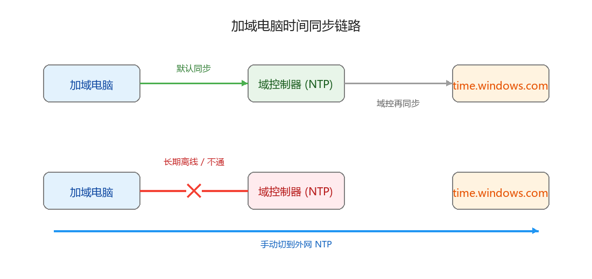
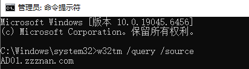
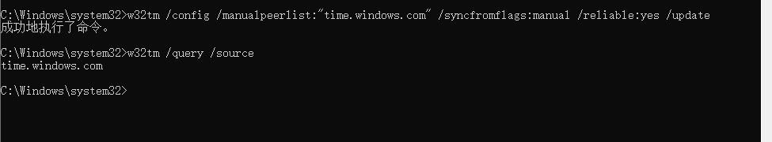
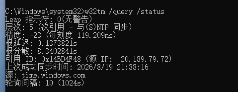
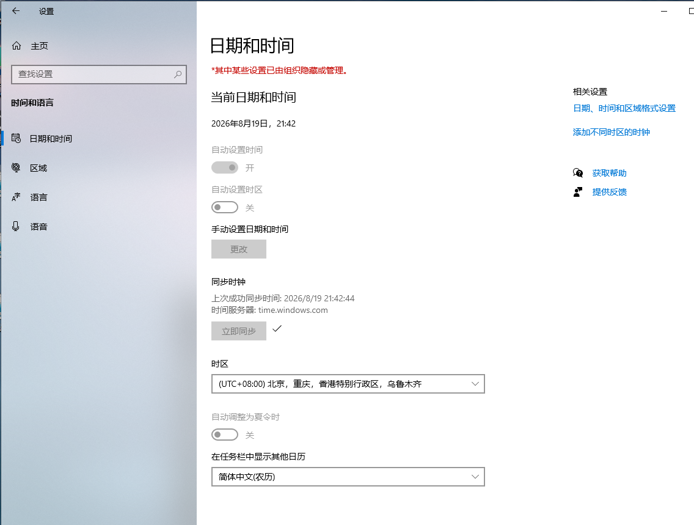

# 加域电脑长时间离线后时间不准的排查与修复

## 问题场景

你的公司电脑加入了公司的 **Active Directory 域**（AD 域）。平时在办公室时，电脑会自动和**域控制器（Domain Controller）**同步时间。

但以下情况，电脑可能会逐渐出现时间偏差：

- 长期居家办公，连不上公司内网
- 出差在外，没有 VPN
- 域控关机或网络故障

时间久了，你会发现电脑时间快了几分钟甚至十几分钟，导致：

- 会议软件时间对不上
- 浏览器提示证书时间错误
- 登录域账号失败（Kerberos 认证对时间敏感）

## 为什么会这样

加入域的 Windows 电脑，默认会把**域控制器**当作时间源。


*图 1：正常时跟域控同步；离线后失去时间源，可手动切到外网 NTP*

当电脑能连通域控时，这个时间同步链路是通的；一旦断开，电脑就失去了时间源，只能靠主板电池维持，时间一长就会漂移。

## 先确认当前的时间源

打开**管理员权限的命令提示符**或 **PowerShell**，输入：

```cmd
w32tm /query /source
```

可能看到的结果：

- `DC01.contoso.local` → 正在同步域控（正常）
- `Local CMOS Clock` → 在用主板时钟，说明已经失联一段时间



## 修复：手动指定外网时间服务器

> ⚠️ **执行前提**：以下命令必须在没有连接域控制器时操作。但是完成修改后，后期连上域控是不会变化的


### 步骤 1：以管理员身份打开命令提示符

搜索 `cmd`，右键选择 **以管理员身份运行**。

### 步骤 2：配置外网 NTP 服务器


*图 2：在管理员命令提示符中执行 w32tm 命令*

这里以 `time.windows.com` 为例（微软官方时间服务器，国内通常可访问；如果访问慢，也可以换成 `cn.ntp.org.cn`）：

**推荐写法（普通域成员电脑）：**

```cmd
w32tm /config /manualpeerlist:"time.windows.com" /syncfromflags:manual /update
```

**如果你想让本机也被标记为可靠时间源（可选）：**

```cmd
w32tm /config /manualpeerlist:"time.windows.com" /syncfromflags:manual /reliable:yes /update
```


命令解释：

| 参数 | 含义 |
|------|------|
| `/manualpeerlist` | 手动指定时间源，多个源用空格分隔 |
| `/syncfromflags:manual` | 只从手动指定的源同步 |
| `/reliable:yes` | 标记本机为可靠时间源（可选，普通用户可不加） |
| `/update` | 让配置立即生效 |

如果想更稳，可以同时写多个服务器：

```cmd
w32tm /config /manualpeerlist:"time.windows.com cn.ntp.org.cn" /syncfromflags:manual /update
```

### 步骤 3：立即同步

上面的命令已经带了 `/update` 参数，配置会立即生效，**不需要再重启 Windows Time 服务**。直接执行同步即可：

```cmd
w32tm /resync
```

如果提示 "命令已成功完成"，说明已经开始同步。稍等 10~30 秒后再看时间是否校准。

## 验证是否同步成功

再次执行：

```cmd
w32tm /query /status
```



关注输出里的几行：
- `Source: time.windows.com,0x9` → 说明正在从外网时间源同步
- `Last Successful Sync Time` → 显示最近成功同步的时间
- `Leap Indicator` 等 → 表示 NTP 状态正常

## 图形界面同步时间

**设置 → 时间和语言 → 日期和时间 ,点击”立即同步“



## 
还是同步失败？

如果执行 `w32tm /resync` 后时间仍没校准，可以检查以下几点：

1. **确认 Windows Time 服务在运行**
   ```cmd
   sc query w32time
   ```
   如果状态不是 `RUNNING`，用 `net start w32time` 启动。

2. **检查网络是否能访问外网 NTP**
   外网 NTP 使用 **UDP 123 端口**。某些企业防火墙或路由器会封锁该端口，可尝试换一个时间源，例如 `cn.ntp.org.cn` 或 `pool.ntp.org`。

3. **手动强制同步**
   ```cmd
   w32tm /config /update
   w32tm /resync /rediscover
   ```

4. **查看详细状态排查**
   ```cmd
   w32tm /query /status /verbose
   ```

## 重要提醒：回到办公室后建议改回域控

这个外网 NTP 配置适合**临时救急**，但长期留在域环境里使用，可能会造成问题：

- 域控和外网时间源可能有微小偏差
- 偏差超过 5 分钟时，登录域账号可能失败（Kerberos 默认允许的时间差约为 5 分钟）

**所以，只要电脑能重新连上域控，优先恢复域控同步；只有在确实连不上域控时才使用外网 NTP。**

恢复默认命令：

```cmd
w32tm /config /syncfromflags:domhier /update
net stop w32time && net start w32time
w32tm /resync
```

这条命令的意思是：**按照域层级同步时间**（也就是重新跟着域控走）。

## 速查表

| 场景 | 命令 |
|------|------|
| 查看当前时间源 | `w32tm /query /source` |
| 切到外网 NTP | `w32tm /config /manualpeerlist:"time.windows.com" /syncfromflags:manual /update` |
| 立即同步 | `w32tm /resync` |
| 强制同步 | `w32tm /resync /rediscover` |
| 恢复域控同步 | `w32tm /config /syncfromflags:domhier /update` |

> 注：`/update` 已让配置立即生效，因此切到外网 NTP 后**不需要重启** `w32time` 服务，直接执行 `w32tm /resync` 即可。

## 总结

加域电脑默认跟域控走时间，长期离线就会漂移。用 `w32tm` 命令临时把电脑指向 `time.windows.com` 等外网 NTP 服务器，就能救急。能回公司后，记得恢复成域层级同步，避免后续登录异常。
