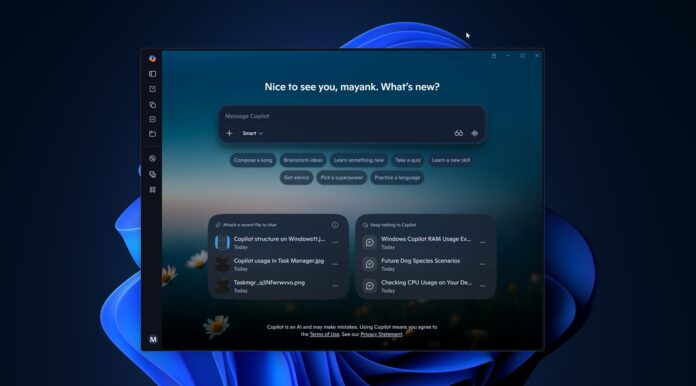
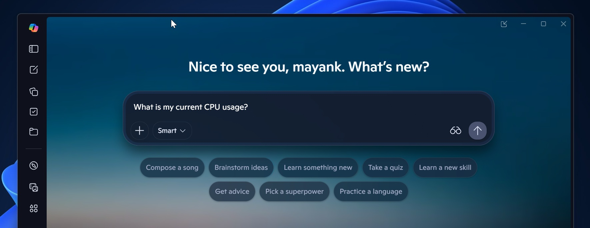
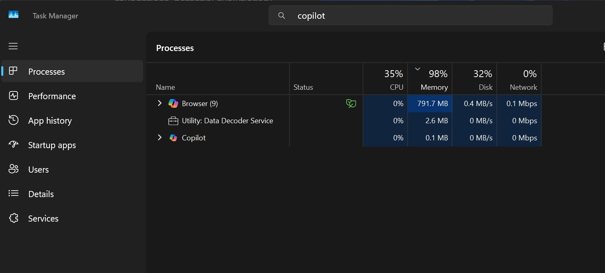
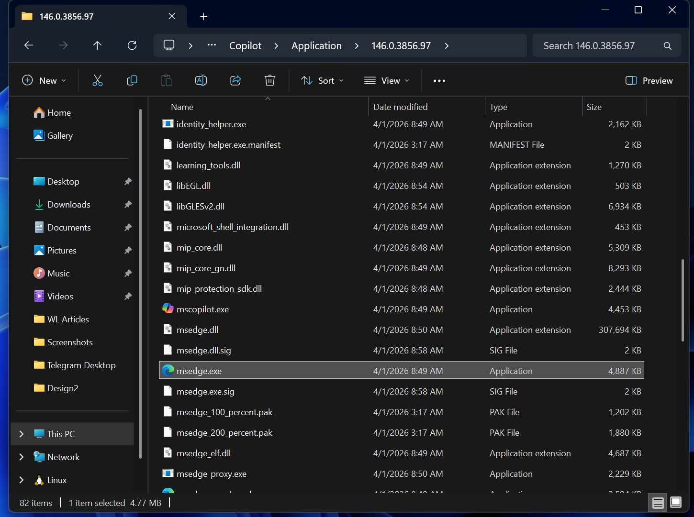
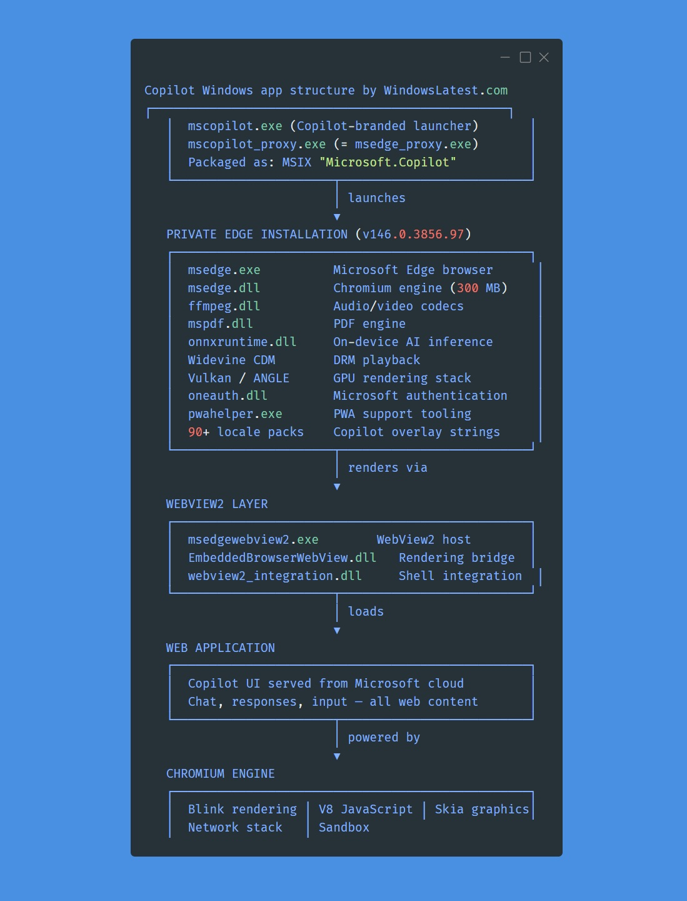

# Windows 11 Copilot 新增 PC Insights 实验功能：可对话查询 PC 状态，自身空载已占近 1GB 内存

*图：Copilot for Windows 应用主界面（来源：Windows Latest）*

微软正在为 Windows 11 的 Copilot 推出一项名为 **PC Insights** 的实验功能，用户可直接向 Copilot 提问关于本机状态的问题，并以自然语言获得回答。该功能目前仅在美国地区小范围灰度推送，**尚未对所有用户开放**——其细节主要由 Windows Latest 通过微软支持文档和 Copilot 应用代码中的引用提前披露。

## PC Insights 能做什么

*图：Copilot 应用首页（来源：Windows Latest）*

PC Insights 是一项**可选加入（opt-in）**的实验功能。在用户授权的前提下，Copilot 可以读取并解读本机的系统资源、连接设备和文件元数据。Windows Latest 整理了 Copilot 当前可读取的信息范围，包括 **CPU、RAM、GPU 使用率与可用存储容量**；**USB 外设、打印机、摄像头等连接设备及其状态**；**Bluetooth 与 Wi-Fi 网络信息**；以及**电池健康、杀软运行状态、BIOS 与整机配置**。Copilot 无法读取单个文件的具体内容，但可以计算文件夹及单个文件的占用大小，包括"下载"和"文档"目录的体积。

微软给出的典型问题示例包括：**"我是否有足够的空间安装 100GB 的游戏？"**、**"我装的是什么显卡？"**、**"当前的 CPU 占用率是多少？"** 微软在支持文档中写道，「在获得你的授权后，Copilot 会收集相关信息，并以通俗语言向你说明，方便你更快地采取行动」。用户随后可以追问"能不能装《GTA V》"，Copilot 会查询网络并报告该游戏需要超过 100GB 空间，比当前可用空间多 13GB，进而建议清理文件。

微软支持页给出了更完整的示例问题清单，按使用场景分为 4 类：

| 分类 | 示例问题（中文翻译） |
|---|---|
| **设备与系统（Device and system）** | 我的电脑完整配置是什么？ / 杀软是否在运行？ / 我的电池健康度如何？ / 我的 BIOS 版本是什么？ |
| **性能与活动（Performance and activity）** | 我的电脑插了哪些 USB 设备？ / 当前的 CPU 使用率是多少？ / 我的外置硬盘是否被识别？ / 我的电脑有哪些网络适配器？ |
| **存储与文件（Storage and files）** | 我的「下载」文件夹有多大？ / 我是否有足够的空间安装一个大型游戏或应用？ |
| **连接设备（Connected devices）** | 我的打印机是否在线？ / 我的摄像头是否被检测到？ |

英文原文逐字保留：

| Category | Example questions to ask Copilot |
|---|---|
| **General examples** | "What graphics card do I have?" / "Do I have enough space for a 100GB game?" / "What's my current CPU usage?" |
| **Device and system** | "What are my computer's full specifications?" / "Is my antivirus running?" / "How is my battery health?" / "What's my BIOS version?" |
| **Performance and activity** | "What USB devices are plugged into my computer?" / "What's my current CPU usage?" / "Is my external hard drive recognized?" / "What network adapters does my PC have?" |
| **Storage and files** | "How big is my Downloads folder?" / "Do I have enough storage for a large game or app?" |
| **Connected devices** | "Is my printer online?" / "Is my webcam detected?" |

*注：「通用示例（General examples）」一类在微软支持页中未单列，应是 Windows Latest 编辑从 Copilot 应用代码引用中整理后补充到表格的；与"性能与活动"和"存储与文件"两类存在条目重叠（CPU 使用率、存储空间）。本表按贴出的结构保留。*

## 隐私边界：只读、不训练

*图：Windows Latest 在 32GB 内存机器上开启 Copilot 后截取的任务管理器画面，标识为「Browser / Copilot」的进程占用接近 1GB 内存（来源：Windows Latest）*

PC Insights 默认不具备自动后台扫描的权限。微软强调，「Copilot 只会在获得你的授权后访问信息。当你提出问题时，Copilot 会在访问你电脑上的相关信息前先征得你的同意」，并承诺「你可以在每一步都保持掌控」。如果用户愿意授权 Copilot 持续读取硬件与存储数据，可在 Copilot 设置中将权限从"每次询问"切换为"始终允许"。不过，**PC Insights 目前为只读访问**——Copilot 「不会代替你进行修改」，不会自动执行修复动作，未来是否调整这一限制微软尚未明确。

在模型训练方面，微软明确表态，「你的个人文件与系统信息不会被存储，也不会被用于模型训练」。同时补充称，「根据你的设置，Copilot 可能会利用对话活动（例如你输入的提示与收到的回答）来改进体验，包括训练 AI 模型」——即**个人文件与系统信息不进入训练语料；仅对话活动（提示与回答）可能用于改进模型**，且取决于用户设置。

## 反讽：Copilot 自身空载即占近 1GB 内存

*图：Copilot for Windows 安装目录中包含 msedge.exe（即完整的 Microsoft Edge 二进制）（来源：Windows Latest）*

Windows Latest 编辑 Mayank Parmar 指出，PC Insights 的定位是替代任务管理器、设置面板和文件资源管理器；但讽刺的是，**Copilot 应用本身就是一个资源占用大户**。他在 32GB 内存的设备上仅打开 Copilot、未执行任何操作时观察到进程占用约 **800MB**，部分场景下接近 **1GB**。在任务管理器中，该进程甚至以 **"Browser"** 标识出现。

*图：Copilot for Windows 应用安装目录结构（来源：Windows Latest）*

原因在于 Copilot 内嵌了一整套独立的 Microsoft Edge 浏览器（含完整的 msedge.exe 与 Chromium 代码），用于支持新增的"内置浏览"功能——用户无需跳转默认浏览器即可在 Copilot 中打开网页。Parmar 写到，Copilot for Windows 最初以 Edge 浏览器内的侧边栏（Edge Sidebar）形式出现，几经重写后曾基于 **WinUI**（微软原生 Windows UI 框架）构建为原生应用、性能一度显著改善。但在微软 AI CEO **Mustafa Suleyman** 团队方向调整之后，消费版 Copilot 的产品路线似乎发生变化，**最新版本重新回到 Web 应用形态**——浏览器内核直接渲染云端 Copilot 页面，并捆绑独立 Edge 实例——这被认为是其内存占用居高不下的直接原因。Parmar 调侃道：「如果微软希望用户借助 Copilot 来优化 Windows 11 的性能，那它自己就应该先把 Copilot、Microsoft Teams、Outlook，以及过去几年堆出来的那些『网页垃圾』优化好」。

## 部署状态与用户控制

PC Insights 在 Copilot on Windows 应用中作为**实验性功能**逐步推出。微软支持页明确指出，「PC Insights 正在面向 Windows 上的 Copilot 应用用户逐步推出，可能并非在所有设备上可用。作为一项实验性功能，PC Insights 仍在持续演进，不一定总能给出完整或准确的信息」。是否启用、何时启用，均取决于用户当前的账户与设备状态。

对不希望使用该功能的用户，微软提供了两条路径：在 Copilot 设置中将权限维持在"每次询问"，或在企业环境中通过组策略（Group Policy）禁用 Copilot 应用本身。Windows Latest 同时指出，用户也可以直接卸载 Copilot，以彻底回避 PC Insights 与相关资源占用。

---

**参考来源**

- [Windows Latest: "Windows 11 Copilot now tells you what's slowing down your PC, while using 1GB RAM itself"](https://www.windowslatest.com/2026/07/12/windows-11-copilot-ai-can-now-tell-you-whats-slowing-down-your-pc-while-using-1gb-of-ram-itself/) — 直接引语来源、内存占用数据、Copilot 演进背景
- [Microsoft Support: "Use the Copilot on Windows app to get PC insights and understand your device"](https://support.microsoft.com/en-us/microsoft-copilot/pc-insights) — PC Insights 功能定义、隐私边界、模型训练政策的官方表述