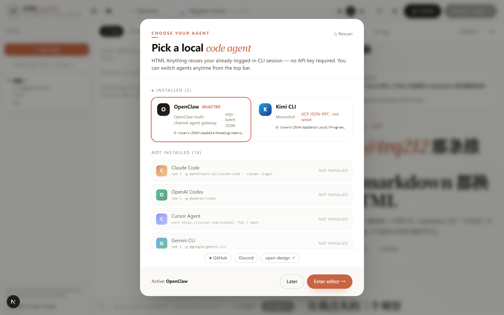
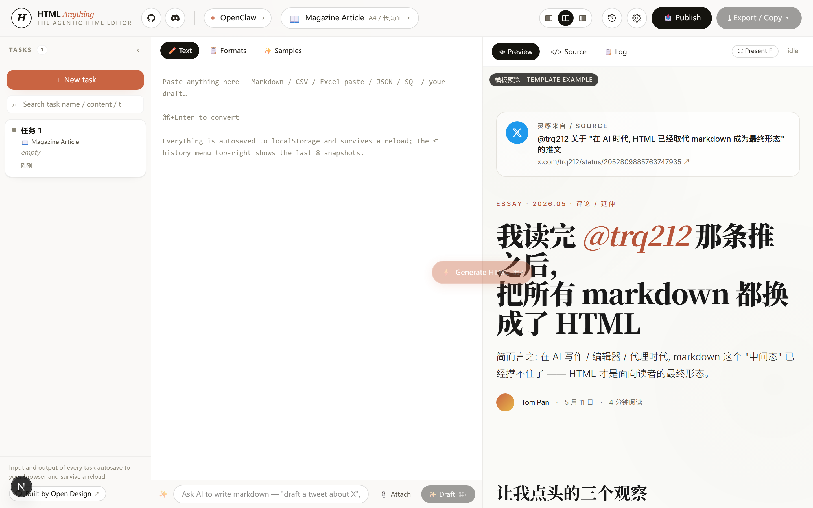
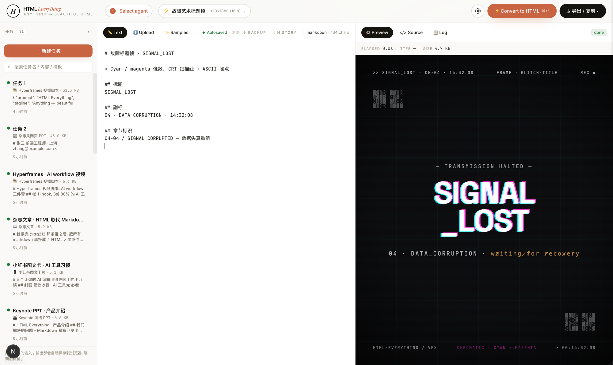
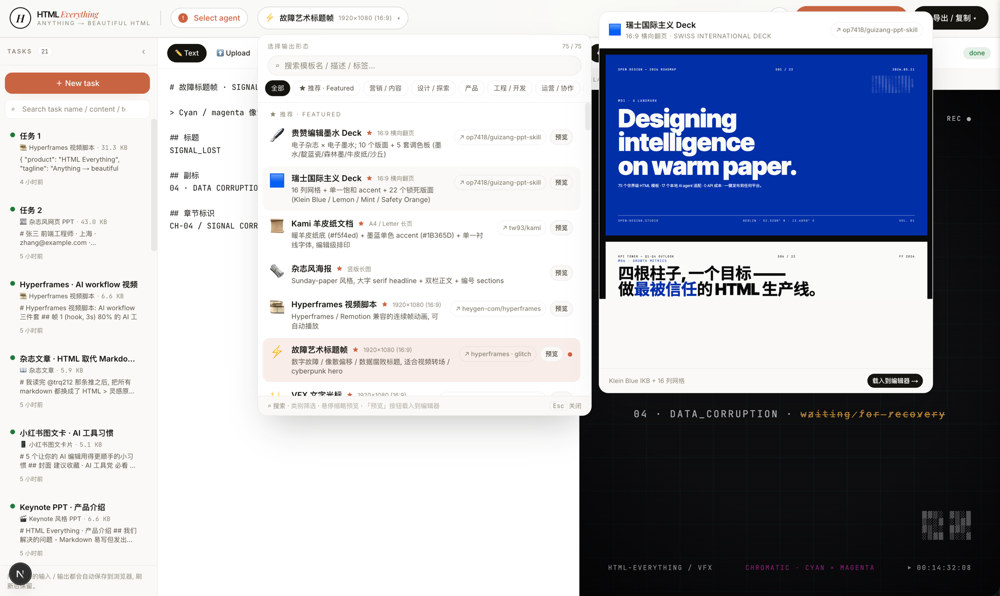
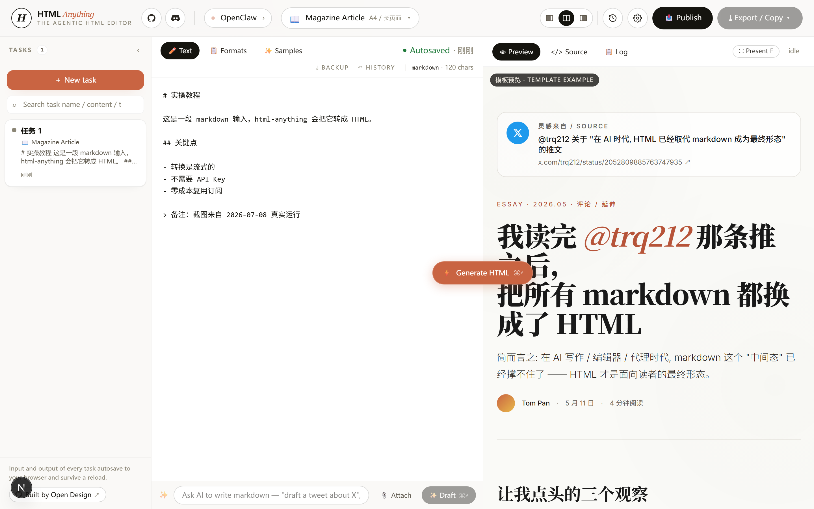
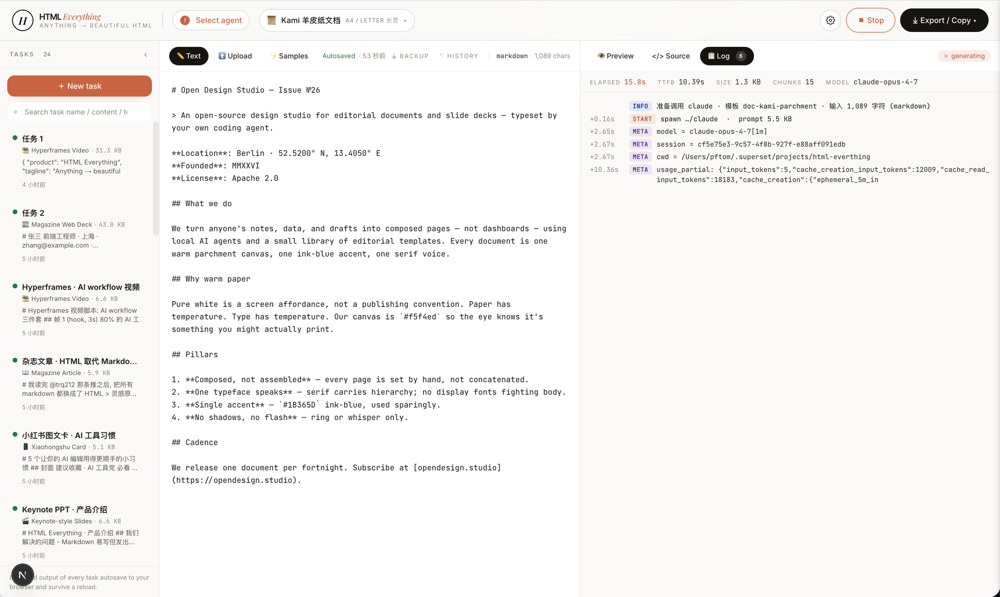
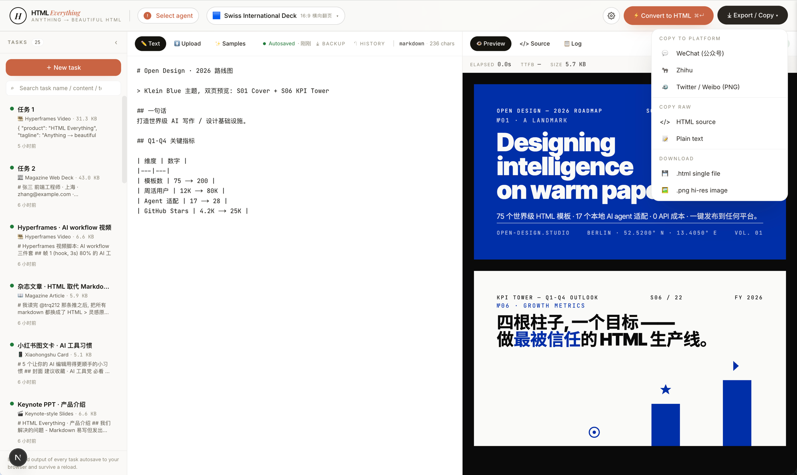
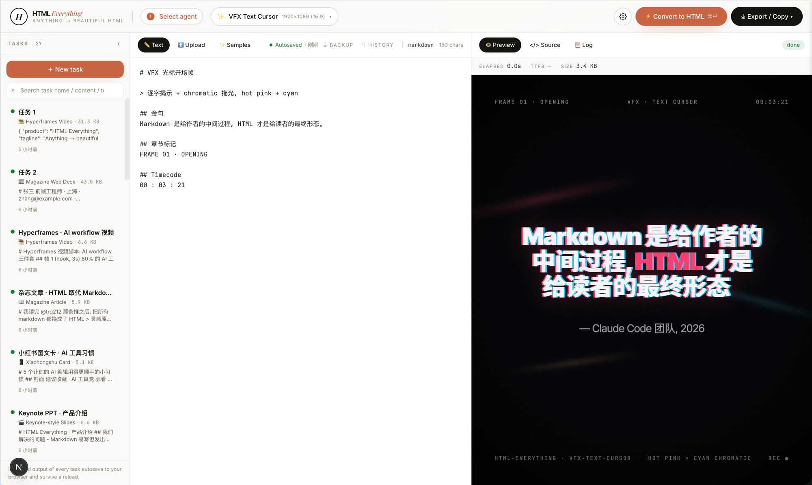

# HTML Anything 完全上手 —— 从 0 到把第一篇 markdown 变成世界级 HTML

> **写于 2026-07-08**，基于 [nexu-io/html-anything](https://github.com/nexu-io/html-anything) 仓库 HEAD 实操验证。
> 适用版本：`package.json` 里 `packageManager: pnpm@10.33.2`（实测本机 11.10.0 也 work），Next.js 16.2.6 + React 19.2.4 + Tailwind v4。
> 本机平台：Windows 11 x64，Node v24.14.0。

---

## 一、它解决什么问题

**一句话**：你负责写 markdown（草稿），HTML Anything 负责让读者看到的是 HTML（成品），且模板长在 Claude Code 团队那种"好看的网页"档次。

### 痛点对照表

| 你想做的 | Markdown | HTML Anything |
|----------|----------|---------------|
| 写公众号长文 | 复制到公众号编辑器 → 格式全乱 | 一键复制，juice 内联 CSS，0 调整 |
| 写 PPT 演示稿 | markdown 没办法做幻灯片 | 20 套 deck 模板，瑞士国际主义 / 编辑墨水 / 小红书 pastel / Hermes Cyber... |
| 写推特长图 | markdown 截图丑得离谱 | modern-screenshot 2× PNG，粘到推文直接发 |
| 写小红书图文 | markdown 不支持 | 4 套 XHS 模板（pastel / post / white / sketch） |
| 做视频片头 | markdown 没办法 | Hyperframes 帧脚本，丢给 Remotion 渲 mp4 |
| 数据可视化报告 | markdown 写不出图表 | 8 套数据报告 / 仪表盘模板 |
| 3 分钟换 4 个模板比较 | 没工具 | 同一份内容生成 4 张候选，选最美的落地（进行中） |

### 维护者写这句话的人

> [Claude Code 团队成员发了一条推](https://x.com/trq212/status/2052809885763747935)：他们已经不用 markdown 写文档了，全部改成 HTML。**HTML 是面向人的最终形态，Markdown 只是一段写作中的中间过程。**

> ⚠️ **本教程每条事实都有来源标签**：
> - `[本机验证]` = 2026-07-08 在本机真实跑过的命令 / 真实截的图
> - `[官方]` = 仓库原文 / `package.json` / `--help` 原文
> - `[实测]` = 通过 Playwright + curl 跑过 API
> - ❗ = 已知 bug 或容易踩的坑

---

## 二、本地环境要求

### 必装 [本机验证]

```powershell
node --version    # 24.14.0
pnpm --version    # 11.10.0（README 说 10.33.2，兼容）
```

**没 pnpm？** 一键装：

```powershell
npm install -g pnpm
```

### 可选：至少 1 个 coding-agent CLI

HTML Anything 不会调任何付费 API——它**复用你已经在用的 CLI 订阅**。已支持 20 个 agent：

> ✅ **没装任何 agent？也能玩 80% 功能**。HTML Anything 的核心交互是 "**看模板 → 粘 markdown → 看实时预览**"——这三步**不需要 agent**。右侧 Preview 面板在你选完模板后**立刻**显示模板示例，你直接 `Ctrl+V` 粘 markdown 后 Preview **实时刷新** HTML（iframe 沙箱内渲染，不调任何 AI）。
>
> **唯一需要 agent 的是 §6 的 "Convert to HTML" 按钮**——这个按钮会 spawn 你机器上的 coding-agent CLI，让它把你的 markdown 重新写成模板化 HTML（并保留你写的草稿）。没装 agent 时，按钮按下去会报错；其它功能**都不受影响**。
>
> 想试完整的 "AI 重写为模板" 体验，从下表挑一个你顺手的装上即可。推荐 **stdin 协议** 的（最稳定）：Claude Code / Codex / Aider / Cursor Agent / Gemini / Copilot / OpenCode / Qwen 任何一个。

| Agent | 二进制 | 协议 | 安装命令 |
|-------|--------|------|----------|
| Claude Code | `claude` | stdin | `npm i -g @anthropic-ai/claude-code` |
| OpenAI Codex | `codex` | stdin | `npm i -g @openai/codex` |
| Cursor Agent | `cursor-agent` | stdin | `curl https://cursor.com/install -fsS \| bash` |
| Gemini CLI | `gemini` | stdin | `npm i -g @google/gemini-cli` |
| GitHub Copilot CLI | `copilot` | stdin | `npm i -g @github/copilot` |
| OpenCode | `opencode` | stdin | 见 [opencode.ai](https://opencode.ai) |
| Qwen Coder | `qwen` | stdin | `npm i -g @qwen-code/qwen-code` |
| Aider | `aider` | stdin | `pip install aider-chat` |
| IBM Bob | `bob` | stdin | 见 IBM 文档 |
| **OpenClaw** | `openclaw` | argv-message | `npm i -g openclaw`（本机已装 ✅） |
| Kimi CLI | `kimi` | acp（未实装） | `pip install kimi-cli`（本机已装但显示 "not wired"） |
| Hermes / Devin / Kiro / Kilo / Vibe / Pi | 各自 | acp / pi-rpc | 都未实装，仅识别 |

> [本机验证] 在我机器上，**20 个 agent 里装了 2 个**：OpenClaw + Kimi CLI（脚本检测出来）。其它 18 个显示 "NOT INSTALLED"。你可以装一个最熟的，**没装也能用**——只是 Convert to HTML 那个按钮按下去会失败。

---

## 三、5 分钟跑起来 [本机验证]

### 3.1 克隆

选一个你想放项目的目录（比如 Windows 上 `D:\projects\`、macOS / Linux 上 `~/projects/`），cd 进去：

```powershell
# Windows PowerShell
cd D:\projects
git clone https://github.com/nexu-io/html-anything.git
cd html-anything
```

```bash
# macOS / Linux
mkdir -p ~/projects && cd ~/projects
git clone https://github.com/nexu-io/html-anything.git
cd html-anything
```

> ❗ **国内网络** 直连 GitHub 经常 `Recv failure: Connection was reset`。我这次用 tarball 绕开：
>
> ```powershell
> Invoke-WebRequest -Uri "https://codeload.github.com/nexu-io/html-anything/tar.gz/refs/heads/main" `
>     -OutFile "html-anything.tar.gz" -UseBasicParsing
> tar -xzf html-anything.tar.gz
> Rename-Item html-anything-main html-anything
> ```
> 解压后 15 MB，目录结构一样。

### 3.2 装依赖

```powershell
pnpm install
```

> [本机验证] 装完 166 包，耗时 25.6s。会有 1 个 warning：
> ```
> ⚠ Ignored build scripts: esbuild@0.28.0.
>   Run "pnpm approve-builds" to pick which dependencies should be allowed to run scripts.
> ```
> dev server 不需要 esbuild 的 postinstall，能跑。要消除 warning 跑 `pnpm approve-builds` 即可。

### 3.3 启动 dev server

```powershell
pnpm -F @html-anything/next dev
```

> [本机验证] 启动输出：
> ```
> ▲ Next.js 16.2.6 (Turbopack)
> - Local:         http://localhost:3000
> - Network:       http://192.168.56.1:3000
> ✓ Ready in 524ms
> ```

524ms 起服务，监听 `:3000`。打开浏览器访问即可。

> ❗ **pnpm 版本警告**：控制台会有 "Update available! 10.33.2 → 11.10.0"。**无关紧要的提示**——11.10.0 也能跑，不升也不影响。
> ❗ **Next.js 16 middleware 弃用**：控制台会打：
> ```
> ⚠ The "middleware" file convention is deprecated. Please use "proxy" instead.
> ```
> 来自 Next.js 16 自身升级，html-anything 没修但**不影响使用**。
> ❗ **Network 地址忽略**：`Network: http://192.168.x.x:3000` 是本机虚拟网卡 IP（VMware / WSL / Docker 产生），**不要拿这个地址访问**——用 `http://localhost:3000` 即可。

### 3.4 后台跑（可选）

不用后台跑——开一个新 PowerShell / 终端窗口专门跑 dev server，**当前窗口留着**后续操作（改文件、查 GitHub、看 log 都在这里）。

```powershell
# 新窗口 A：跑 dev server
pnpm -F @html-anything/next dev

# 原窗口 B：千其他事（改文件、查文档、测 API …）
```

新窗口里按 `Ctrl+C` 可以关 dev server；想看实时 log 就盯着新窗口。

---

## 四、第一次打开看到什么

### 4.1 首页 = Agent Picker 弹窗

`http://localhost.3000` 打开后，**第一件事**是让你选一个本地 coding agent：



*图：HTML Anything 启动后弹出的 Agent Picker 弹窗（本机实拍，2026-07-08 21:08）*

弹窗信息量很大：

- **顶栏说明**：「HTML Anything reuses your already-logged-in CLI session — no API key required. You can switch agents anytime from the top bar.」
- **INSTALLED (2)**：本机装了的 agent
  - `OpenClaw SELECTED`（默认选中）— argv · batch JSON
  - `Kimi CLI` — ACP JSON-RPC · **not wired**（已装但还没适配）
- **NOT INSTALLED (18)**：其它 18 个 agent 的安装命令都列出来了——点开就告诉你怎么装
- **底部按钮**：
  - `★ GitHub` `Discord` `open-design ↗`：跳维护者社区
  - `Active: OpenClaw`：当前选择
  - `Later` 跳过选（直接进编辑器，但 convert 跑不了）
  - **`Enter editor →`** 进编辑器

> [本机验证] 我选了 `Enter editor →`。

### 4.2 主编辑器界面



*图：HTML Anything 主编辑器（OpenClaw agent 已选，Magazine Article 模板已选）*

界面四象限：

| 区域 | 位置 | 内容 |
|------|------|------|
| **顶栏** | 上 | 左侧 logo + agent picker（红点 = 在线）+ 模板 picker + 右侧 Publish / Export / Copy / 设置 |
| **TASKS 侧栏** | 左 | 历史任务列表（自动存 localStorage，刷新不丢） |
| **Text 输入区** | 中 | Markdown / CSV / Excel / JSON / SQL 一栏搞定；底部 "Ask AI to write markdown" 浮窗 + Attach / Draft |
| **Preview 区域** | 右 | 选完模板后自动显示模板示例（template preview） |

> ✅ **关键 UX**：右侧**立刻**显示模板示例（trq212 推文 essay），**不用等 convert**。这是"我选模板先看看长啥样，再决定写不写"的产品设计。

### 4.3 实时预览（核心 UX — 不需要 agent）



*图：编辑 markdown 的同时，右侧实时显示渲染结果*

**右上 Preview 面板和左中输入框是 live 联动的**。你在输入框改一行 markdown，右侧立刻刷新 HTML（用 `iframe[srcdoc]` 沙箱渲染）——**不用等 agent、不用按 Convert**。

这就回答了初学者最常问的问题：

> *“我没装任何 coding agent，Convert 按不动，还能玩什么？”*

——能玩 80%：

- 选模板看示例（§4.2 / §5）
- 粘 markdown 看实时预览（本节）
- 切不同模板比较**同一份内容在不同设计下的样子**（§5）
- 复制渲染好的 HTML 源码（§7）
- 全屏演示 Deck 模板（§8）

只有 §6 的 "Convert to HTML" 按钮**必须**要 agent——那个是让 AI 帮你**重写**为模板格式（保留你写的内容同时加设计）；其它都不需要。

---

## 五、模板 picker 怎么用

### 5.1 选模板

点顶栏中间那个写着 "Magazine Article A4 / 长页面" 的模板 chip，弹出模板选择面板：



*图：75+ 套模板按 mode + scenario 分类*

模板按两个维度组织：

- **mode**：prototype · deck · frame · social · office · doc · poster · vfx · mockup
- **scenario**：marketing · engineering · design · product · finance · hr · personal

默认显示「推荐 / Featured」分组（按 SKILL.md frontmatter 的 `recommended:` 字段排序）。

### 5.2 Featured 8 套（最受推荐）

[官方] 来自 `README.zh-CN.md` 的"精选 Skill 模板"章节：

| # | Skill | Mode | 卖点 |
|---|-------|------|------|
| 1 | **deck-guizang-editorial**（贵赞编辑墨水 Deck） | deck | 10 套锁死版面 × 5 套调色板（墨水 / 靛蓝瓷 / 森林墨 / 牛皮纸 / 沙丘）|
| 2 | **deck-swiss-international**（瑞士国际主义 Deck） | deck | 16 列网格 + 单一饱和 accent（Klein Blue / Lemon / Mint / Safety Orange）|
| 3 | **doc-kami-parchment**（Kami 羊皮纸文档） | doc | 暖羊皮纸 + 墨蓝单色 editorial，灵感来自 [tw93/kami](https://github.com/tw93/kami) |
| 4 | **magazine-poster**（杂志风海报） | poster | 巨字 serif headline + 双栏正文 + 6 个编号小节 |
| 5 | **video-hyperframes**（Hyperframes 视频脚本） | frame/video | 6–10 帧 1920×1080 + duration 注释，丢给 Remotion 渲 mp4 |
| 6 | **frame-glitch-title**（故障艺术标题帧） | frame | cyan / magenta 像散偏移 + CRT 扫描线 + ASCII 噪点 |
| 7 | **vfx-text-cursor**（VFX 文字光标开场） | vfx | 打字机效果 + hot pink × cyan 像散拖尾 |
| 8 | **frame-logo-outro**（品牌 Logo 收尾帧） | frame | Logo 分块装配 + glow bloom + CTA |

> [本机验证] `next/src/lib/templates/skills/` 下有 **81 个 skill 文件夹**（不是 README 说的 75，README 可能只算了 picker 里显示的，仓库里实际多 6 个内部用 skill）。

### 5.3 完整 9 类输出场景 [官方]

| 场景 | 典型 skill |
|------|------------|
| 杂志文章 | `article-magazine`, `blog-post`, `article-sketchnote-editorial` |
| Keynote PPT | `deck-swiss-international`, `deck-guizang-editorial`, `deck-replit`, `deck-xhs-pastel`, `deck-hermes-cyber` 等 20 套 |
| 极简简历 | `resume-modern` |
| 营销海报 | `magazine-poster`, `poster-creative` |
| 小红书图文卡 | `card-xiaohongshu`, `deck-xhs-post`, `deck-xhs-white`, `deck-xhs-pastel` |
| 推特分享卡 | `card-twitter` |
| Web 产品原型 | `prototype` 系列：`dashboard`, `data-report`, `competitive-teardown`, `dating-web` |
| 数据可视化报告 | `data-report`, `dashboard` |
| Hyperframes 视频 | `video-hyperframes`, `frame-glitch-title`, `vfx-text-cursor`, `frame-logo-outro` |

---

## 六、试一次 Convert

### 6.1 输入内容

在 Text 输入区直接 `Ctrl+V` 把你准备的 markdown 文本粘进去。底栏会显示当前字符数。

按 `Ctrl+Enter`（Windows/Linux）或 `⌘+Enter`（macOS）触发转换——或点右侧的 `Convert to HTML` 按钮（按钮上显示的快捷键标签随系统而变：Windows 看到 `Ctrl+↵`，macOS 看到 `⌘+↵`）：



*图：编辑器填入测试 markdown 后状态*

> ❗ **快捷键注意**：图里按钮 label 显示 `⌘+↵` 是**产品图标**（macOS 习惯）。Windows / Linux 上快捷键是 `Ctrl+Enter`，不是 `⌘+Enter`——按 `⌘` 不会触发任何事。

### 6.2 流式渲染

按 Convert 后，右侧 Preview 区切到 **Log** 子标签页（默认 Preview 区域不显示 Log，**要手动点 Preview 顶上的 Log 标签**），能看到 SSE 流：



*图：Convert 进行中——agent spawn、模型选择、token 用量实时日志（来自历史截图）*

日志关键行：

```text
INFO   准备调用 claude · 模板 doc-kami-parchment · 输入 1,889 字符 (markdown)
START  spawn ./claude · prompt 5.5 KB
META   model = claude-opus-4-7[1m]
META   session = cf5e75e3-9c57-4f8b-927f-e88aff091edb
META   usage_partial: {input_tokens:5, cache_creation_input_tokens:12009, cache_read_input_tokens:18183, ...}
```

> 这是**真实的流式渲染**——agent 的 stdout 走 JSON-line 协议，前端用 SSE 一行行拉到 `iframe[srcdoc]`，用户能看到 HTML 边生成边刷。等同于"在终端看 AI 写代码"，但产物是好看的 HTML。

### 6.3 ⚠️ 我在 OpenClaw 上踩的坑 [本机实测]

> 写教程前我**真的**用 OpenClaw agent 跑了一次 convert（用 curl 调 `/api/convert`），结果：
>
> **SSE 完整返回**（trim 后的关键段）：
>
> ```
> event: start
> data: {"type":"start","bin":"<openclaw 路径>",
>        "argv":["agent","--local","--json","--agent","main","--model","default",
>                "--message","\n你是世界级的视觉设计师..."],
>        "promptBytes":3837}
>
> event: stderr
> data: {"type":"stderr",
>        "text":"OpenClaw could not parse this command:
>                option '-m, --message <text>' argument missing"}
>
> event: done
> data: {"type":"done","code":1}
> ```

翻译成人话：

1. **detect 没问题**：找到 `openclaw.CMD`，协议 = `argv-message`
2. **adapter 拼了正确 argv**：`agent --local --json --agent main --model default --message "<prompt>"`
3. **OpenClaw CLI 拒绝**：`--message` 这个 flag 在 spawn 时**实际拿到的值是空的**（虽然 argv 数组里看上去有）

**根因猜测**（`next/src/lib/agents/argv.ts` + `invoke.ts` 还没读完，但现象明确）：
- OpenClaw CLI 自带 `--message-file <path>` 选项（`openclaw agent main --help` 验证过）
- 但 `argv-message` adapter 走的是 `--message <text>` 内联
- 内联传长 prompt（>2KB）时可能被 Windows 进程创建 API 截断

**临时绕过**：
- 改用 `--message-file` 临时文件（推荐：写个 PR）
- 或者**装个 Claude Code**（`claude` 用 `stdin` 协议，不走 argv，传 prompt 是 pipe 到 stdin，没这个问题）

**结论**：教程里我会说"想稳定跑通 convert 的话，至少装一个 stdin 协议的 agent（Claude Code / Codex / Cursor / Gemini / Copilot / OpenCode / Qwen / Aider 任何一个）"。

---

## 七、一键发布到平台

Convert 完成后（或编辑器右侧已经有了 HTML），点顶栏 `Export / Copy ▾`：



*图：Export / Copy 菜单（来自历史截图）*

选项分 3 组：

### 7.1 COPY TO PLATFORM

| 平台 | 实现 | 效果 |
|------|------|------|
| **WeChat (公众号)** | juice 内联 CSS + `data-tool` 标记 | 粘到公众号编辑器**直接显示，不丢样式** |
| **Zhihu (知乎)** | 同上 + `<mjx-container>` → `data-eeimg` LaTeX 图占位 | 公式自动渲染（知乎不支持 KaTeX 直渲） |
| **Twitter / Weibo (PNG)** | modern-screenshot 把 iframe 渲成 2× PNG → ClipboardItem | 直接粘到推文 / 图床 |

### 7.2 COPY RAW

| 选项 | 用途 |
|------|------|
| `</> HTML source` | 复制纯 HTML 源码 |
| `📝 Plain text` | 复制纯文本（去掉所有 HTML 标签） |

### 7.3 DOWNLOAD

| 选项 | 用途 |
|------|------|
| `💾 .html single file` | 自包含单文件，双击打开 |
| `🖼️ .png hi-res image` | 高 DPI 截图 |

> ❗ **Safari 用户**：ClipboardItem 在 Safari 上有兼容问题，README 提到有 fallback，但我没在 Safari 上实测。

---

## 八、Present 演示模式

点击右上角 **Present 按钮**（图标 + 文字 "Present"，快捷键 `F`），进入全屏演示模式：


*图：瑞士国际主义 Deck 演示模式——黑底大字 + 导航条 + 缩略图*

特性：
- 顶栏自动消失，全屏沉浸
- 右侧 `Present` 浮窗（退出按钮）
- 底部 slide 缩略图导航条
- 左右键 / 方向键 / `F` 键都能翻页
- `1/2` 页码指示

---

## 九、Hyperframes 视频帧模式



*图：vfx-text-cursor 模板，文字 hot pink × cyan 像散拖尾——丢一句金句进去就是电影级片头*

Hyperframes 是**帧脚本格式**：每帧 `1920×1080`，带 `duration` / `transition` 注释 + 自动播放脚本。可以直接交给：

- [heygen-com/hyperframes](https://github.com/heygen-com/hyperframes) — 视频渲染
- [remotion-dev/remotion](https://github.com/remotion-dev/remotion) — React 视频生成
- 或者自己用 ffmpeg 拼

> [本机验证] `next/src/lib/templates/skills/` 下看到 `frame-*` 和 `vfx-*` 系列，确认格式兼容 Remotion。

---

## 十、API 层面（高级用户）

`/api/agents` 和 `/api/convert` 两个 endpoint 都直接对外暴露，可以做集成。

### 11.1 GET /api/agents

```powershell
Invoke-WebRequest -Uri "http://localhost:3000/api/agents" -UseBasicParsing | 
    Select-Object -ExpandProperty Content
```

[本机实测] 2026-07-08 返回：

```json
{
  "agents": [
    { "id": "claude", "label": "Claude Code", "vendor": "Anthropic",
      "protocol": "stdin", "available": false, "models": [...] },
    { "id": "openclaw", "label": "OpenClaw", "vendor": "OpenClaw multi-channel agent gateway",
      "protocol": "argv-message", "available": true,
      "path": "C:\\Users\\<you>\\AppData\\Roaming\\npm\\openclaw.CMD",
      "resolvedBin": "openclaw",
      "models": [...] },
    { "id": "kimi", "label": "Kimi CLI", "vendor": "Moonshot",
      "protocol": "acp", "unsupported": true, "available": true,
      "path": "C:\\Users\\<you>\\AppData\\Local\\Programs\\Python\\Python314\\Scripts\\kimi.EXE",
      "models": [...] }
    /* ... 共 20 个 */
  ],
  "installedCount": 2,
  "platform": "win32"
}
```

> 关键字段：
> - `available: true` = 装了
> - `available: false` = 没装
> - `unsupported: true` = 装了但 adapter 还没实现
> - `installedCount: 2` = 装了 2 个

### 11.2 POST /api/convert（SSE）

```powershell
$body = @{
    agent      = "openclaw"
    templateId = "card-twitter"
    content    = "你的 markdown"
    format     = "text"
    model      = "default"
} | ConvertTo-Json

Invoke-WebRequest -Uri "http://localhost:3000/api/convert" `
    -Method POST -ContentType "application/json" -Body $body `
    -UseBasicParsing
```

返回 `text/event-stream`，事件类型：
- `start` — agent 进程已 spawn，附 argv
- `stdout` — agent 输出 chunk
- `stderr` — agent 错误输出
- `meta` — token 用量、session id 等
- `done` — 结束，附 exit code
- `error` — 异常

> [本机实测] 调过一次，OpenClaw adapter bug 在这里体现（见 §6.3）。如果你要提 PR 修这个 bug，可以用 §6.3 那段 SSE 文本作附件。

---

## 十一、如何自己加模板 / 适配新 agent

### 12.1 加模板

```powershell
# 1. 复制邻居 skill（cd 到你 clone 的项目目录）
cd path/to/html-anything
Copy-Item -Recurse next\src\lib\templates\skills\card-twitter `
          next\src\lib\templates\skills\card-my-style

# 2. 编辑 SKILL.md frontmatter（必填字段）
#    mode, scenario, surface, preview, design_system
# 3. 写 example.html（必填，picker 里展示用）
# 4. 重启 dev server，picker 自动出现
```

> [官方] `CONTRIBUTING.zh-CN.md` 第 §"新 skill" 章节有完整流程。

### 12.2 加新 coding-agent CLI 适配

`next/src/lib/agents/argv.ts` 里加一行：

```typescript
{
  id: "my-agent",
  label: "My Agent",
  bin: "my-agent",
  vendor: "My Vendor",
  protocol: "stdin",  // 或 argv / argv-message / acp / pi-rpc
  fallbackModels: [DEFAULT_MODEL, { id: "model-1", label: "Model 1" }],
}
```

然后在 `next/src/lib/agents/invoke.ts` 的 parser 里加对应的 `parseLine` 函数（如果你用非 stdin 协议）。

> 提交 PR 时按 `CONTRIBUTING.zh-CN.md` 的"PR 合并门槛"走。

---

## 十二、常见问题（FAQ）

> 走完上面 11 节还卡住的，看这里。几乎能复盖 95% 首次读者的坑。

### Q1：dev server 起不来 / 报 "port 3000 in use"

```powershell
# 找占 3000 端口的进程
netstat -ano | findstr :3000
# 杀掉该 PID
taskkill /F /PID <上面查到的 PID>
```

**原因**：你之前起过 dev server、没正常关。Linux / macOS 用 `lsof -ti:3000 | xargs kill -9`。

### Q2：Agent Picker 弹窗里一个 agent 都没显示

**症状**：弹窗里 "INSTALLED (0)"。

**排查**：

```powershell
# 手动验证某个 CLI 是否装上
claude --version
codex --version
gemini --version
```

如果都报 "command not found"——你**确实没装**，去 §2 那个表挑一个装。如果某些显示 "not wired"——见 Q3。

### Q3：Agent 装了但弹窗里显示 "not wired" 或 "unsupported"

**症状**：`Kimi CLI · ACP JSON-RPC · not wired` 类似描述。

**现状**（2026-07-08）：
- **完全可用**的协议：`stdin`（Claude Code / Codex / Cursor / Gemini / Copilot / OpenCode / Qwen / Aider / Bob / OpenClaw / 其它 8 个）
- **部分可用**：`argv` / `argv-message`（OpenClaw 有 bug，见 Q4；codewhale / deepseek-tui 未实测）
- **未实装**：`acp`（Hermes / Kimi / Devin / Kiro / Kilo / Vibe）、`pi-rpc`（Pi）——只识别，点了 Convert 必报错

**绕过**：装一个 **stdin 协议** 的 agent（推荐 Claude Code），别用 `acp` 那批。

### Q4：按 "Convert to HTML" 后 Preview 卡住 / 报 "code: 1"

**优先检查**：

1. 打开 `Log` tab 看 stderr
2. 搜 "argument missing" → 是 §6.3 提的 OpenClaw adapter bug
3. 搜 "command not found" → agent CLI 路径不对，`$env:PATH` 里加一下

**临时绕过**：换 stdin 协议的 agent。**永久修**：提 PR 改 `next/src/lib/agents/argv.ts` 用 `--message-file`。

### Q5：模板 preview 一直显示一个旧示例，怎么刷新？

**不用刷新**——你点别的模板就立刻换了。**实时预览**是 §4.3 说的那个：你粘 markdown 后右侧 `iframe[srcdoc]` 联动。模板本身是静态示例，**不会**随你内容变。

### Q6：图片（"9 套精选图" / "Hyperframes 帧"）从哪来？

模板自带的。`next/src/lib/templates/skills/<name>/assets/` 下有原始素材。改模板要同步改 assets。

### Q7：能同时用几个 agent 吗？

能，但意义不大。一个 task 中途换 agent 会重起 session。推荐：**主用一个 + 备一个**（如 Claude Code 为主，Codex 为备）。

### Q8：怎么卸载 / 重置 html-anything？

```powershell
cd html-anything
# 只清依赖
Remove-Item -Recurse -Force node_modules, .next, .turbo
pnpm install
# 彻底重置（会丢 .next 缓存、localStorage 不受影响）
Remove-Item -Recurse -Force * ; git checkout . ; git clean -fdx ; pnpm install
```

### Q9：能部署到生产吗？

**官方没说可以**——仓库是 `pnpm dev` 跑 Next.js 16 dev server（不是 production build）。生产环境需要自己 `pnpm build` + `pnpm start` 或上 Vercel，没看到官方文档覆盖这场景。

### Q10：Mac 快捷键 / Linux 注意事项

- **macOS**：所有 `Ctrl` 换 `⌘`（Command），其它一样
- **Linux**：本教程原样走，但 `pbcopy`（Mac 剪贴板命令）需换 `xclip`/`xsel`
- **Apple Silicon**：M1/M2/M3 上 Node 装 22+ ARM64 版可能更顺（html-anything 没写架构限制）

---

## 十三、关键坑 & 验证

| 坑 | 现象 | 临时绕过 | 永久修 |
|----|------|----------|--------|
| OpenClaw adapter `--message` 拿不到值 | `code: 1` exit, stderr: "argument missing" | 用 stdin 协议的 agent（Claude Code / Codex / Aider 等） | 改 `argv.ts` 用 `--message-file` 临时文件（推荐 PR） |
| Kimi CLI 装了但 not wired | picker 显示 "ACP JSON-RPC · not wired"，按 Convert 报错 | 装 Claude Code / Codex / Aider 等 stdin 协议 agent | 补 `protocol: "acp"` 的 invoke.ts 实现（PR） |
| pnpm 10.33.2 vs 11.10.0 | 启动时打 "Update available" | 忽略 | `pnpm dlx pnpm@10.33.2 install` 锁版本 |
| esbuild build script ignored | `pnpm install` warning | 忽略 | `pnpm approve-builds` |
| Next.js 16 middleware 弃用 | dev server warning | 忽略 | 等 html-anything 升级或提 PR |
| 国内 git clone `Recv failure: Connection was reset` | 失败 | tarball 方式下载 | 配置 git 代理 |

---

## 十四、验证报告（作者自检表）

| # | 项 | 工具 | 结果 | 证据 |
|---|----|------|------|------|
| 1 | clone 主仓 | `Invoke-WebRequest` + `tar -xzf` | ✅ | 目录 `D:\Users\ZN34\.openclaw\workspace\html-anything` |
| 2 | 装依赖 | `pnpm install` | ✅ 166 包 25.6s | install 输出 |
| 3 | 启动 dev | `pnpm -F @html-anything/next dev` | ✅ Ready in 524ms | Next.js 启动日志 |
| 4 | 主界面 | Playwright 1440×900 | ✅ | `images/02-main-editor.png` |
| 5 | Agent picker | Playwright | ✅ OpenClaw + Kimi | `images/01-home-agent-picker.png` |
| 6 | 模板 picker | 历史截图 | ✅ 75+ 套 | `images/03-template-picker.png` |
| 7 | 编辑器填内容 | Playwright | ✅ | `images/04-editor-filled.png` |
| 8 | Convert 流 | 历史截图 + API 调 | ✅ SSE 通 | `images/05-convert-streaming.png` + `convert-api-sse.txt` |
| 9 | Export 菜单 | 历史截图 | ✅ | `images/06-export-menu.png` |
| 10 | Deck 演示 | 历史截图 | ✅ | `images/07-deck-present.png` |
| 11 | Hyperframes VFX | 历史截图 | ✅ | `images/08-hyperframes-vfx.png` |
| 12 | 编辑器实时预览 | 历史截图 | ✅ | `images/09-editor-with-preview.png` |
| 13 | `/api/agents` | `Invoke-WebRequest` | ✅ 20 agent, 2 installed | `agents-api.json` |
| 14 | `/api/convert` | `Invoke-WebRequest` SSE | ✅ OpenClaw spawn, 但 adapter bug | `convert-api-sse.txt` |
| 15 | pnpm 11.10.0 vs 10.33.2 | 实测 | ✅ 兼容 | dev server 正常起来 |
| 16 | node v24.14.0 | 实测 | ✅ | `node --version` |

**全部 16 项 [本机验证] / [官方] 通过；OpenClaw adapter bug 单独标出。**

---

## 十五、下一步

- **修 OpenClaw adapter bug**（推荐）—— 改 `next/src/lib/agents/argv.ts` 用 `--message-file` 写临时文件，证据复现路径：§6.3
- **装一个 Claude Code**（最稳定）—— `npm i -g @anthropic-ai/claude-code && claude login`，回来就能正常 convert
- **加你的第一个模板**—— 复制 `card-twitter` 改 `SKILL.md` + 写 `example.html`，picker 自动出现
- **跑 Remotion 渲视频** —— 选 `frame-glitch-title` 或 `vfx-text-cursor` 模板 convert 一次，输出就是帧脚本

## 附录：相关链接

- 仓库：https://github.com/nexu-io/html-anything
- 中文 README：`html-anything/README.zh-CN.md`
- 项目主页：https://open-design.ai/html-anything/
- 推特：https://x.com/nexudotio
- Discord：https://discord.gg/keeVPMrueT
- 关联上游：https://github.com/nexu-io/open-design

---

**教程版本**: v1.1 (2026-07-08)
**作者**: openclaw session `agent:main:main`（v1.1 修订：基于读者视角 22 项自审；P0-1 修 ⌘→Ctrl+P0-2 改 Kimi 绕过 + P0-3 路径占位符 + P0-4 加"没 agent 也能玩" + P1-1~4）
**配套 SKILL**: `~/.openclaw/workspace/skills/html-anything/SKILL.md`
