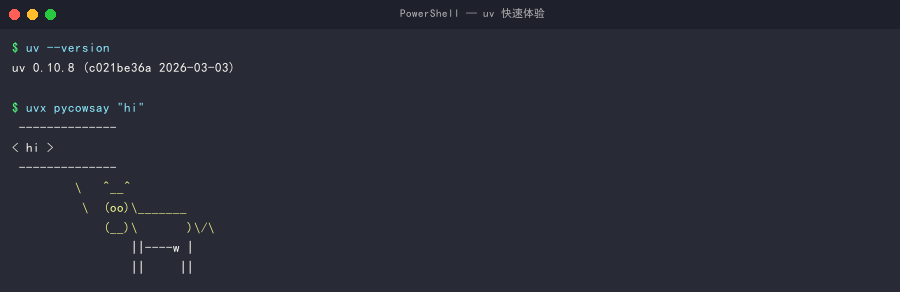
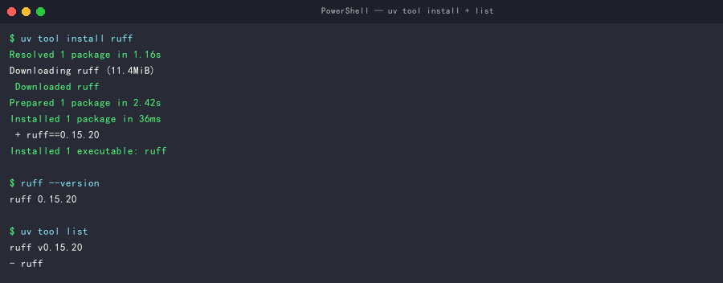
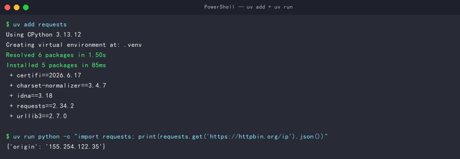
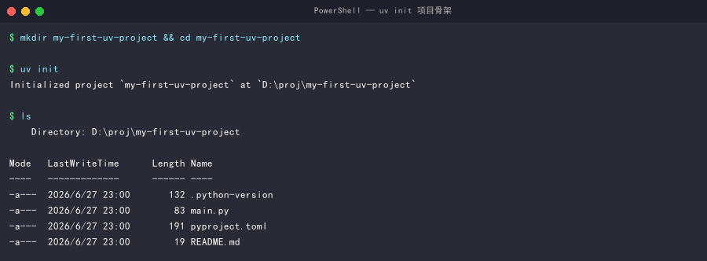
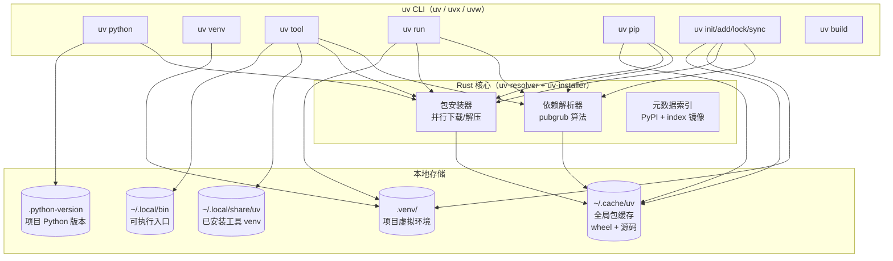
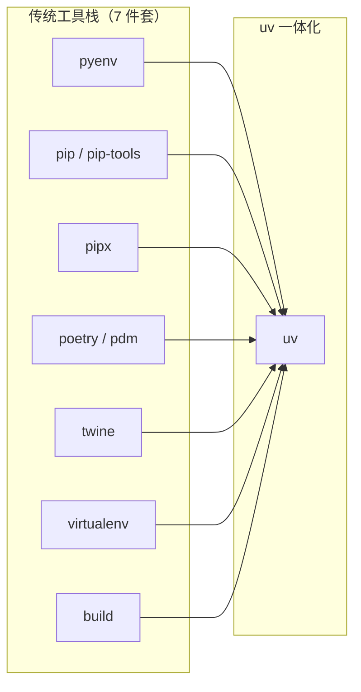
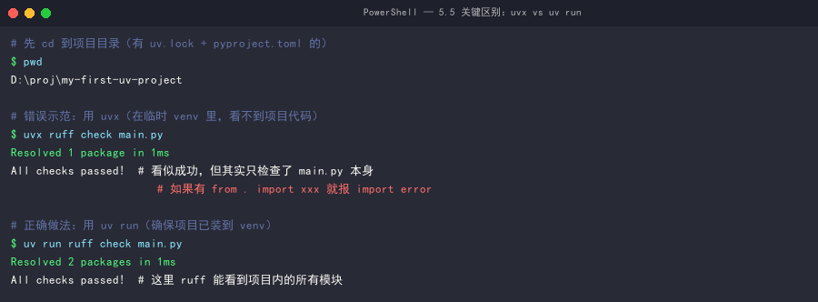
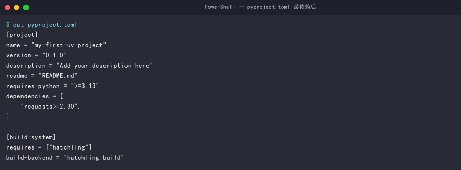
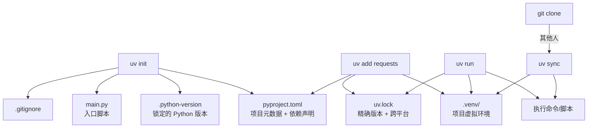
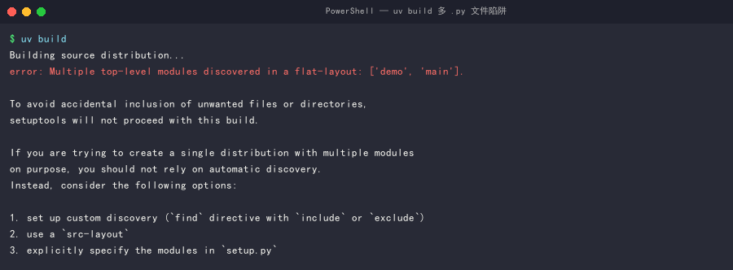

# uv 完全教程：从入门到精通

> **难度**：⭐ 入门 → ⭐⭐⭐ 专家（递进式，按章节走完即可掌握）
> **预计时长**：60–90 分钟（动手 30 分钟 + 阅读 30 分钟）
> **前置知识**：会用命令行（PowerShell / Bash）、了解 Python 包与虚拟环境基础概念
> **适用版本**：uv 0.10.8（基于 2026-06 官方文档，主要命令在本机实际跑过验证）
> **适用系统**：macOS / Linux 为主，Windows 用户看每节里的 🪟 标记


uv 是 Python 社区近年来最值得装的一个工具——它把 Python 开发里常用的 7 个工具（**pip 装包 / pyenv 装 Python / virtualenv 建虚拟环境 / poetry 管项目 / pipx 跑 CLI 工具 / pip-tools 锁版本 / twine 发包**）**打包进一个二进制文件**，**一套 uv 命令搞定所有事**。最大的卖点是**快**：因为底层用 Rust 写，比 Python 写的 pip **快 10–100 倍**（同样是装几十个包，原先十几秒变零点几秒）。背后的公司是 [Astral](https://astral.sh)，就是做 Ruff linter 的同一拨人。

下图来自 uv 官方仓库 BENCHMARKS，展示在热缓存下安装 [Trio](https://trio.readthedocs.io/) 依赖时的耗时对比：


*图：uv vs pip/pip-tools/poetry 在 Trio 依赖热缓存场景下的耗时（数据来源：[astral-sh/uv BENCHMARKS](https://github.com/astral-sh/uv/blob/main/BENCHMARKS.md)）*

---

## 目录

> 💡 路径建议：**初学者**按 0 → 1 → 2 → 3 → 4 → 5 → 6 → 7 → 排错顺序；**有 pip 经验的老用户**直接跳 7 章；**速查**用文末速查表。
>
> 📌 **平台说明**：默认 macOS/Linux 命令，Windows 用户专属命令用 🪟 标记。

- [第 0 章：30 秒体验](#第-0-章30-秒体验)
- [第 1 章：快速认识 uv](#第-1-章快速认识-uv)
- [第 2 章：架构与设计哲学](#第-2-章架构与设计哲学)
- [第 3 章：安装 uv](#第-3-章安装-uv)
- [第 4 章：Python 版本管理](#第-4-章python-版本管理)
- [第 5 章：工具管理（uvx 与 uv tool）](#第-5-章工具管理uvx-与-uv-tool)
- [第 6 章：脚本运行（uv run）](#第-6-章脚本运行uv-run)
- [第 7 章：项目管理（uv init / add / lock / sync）](#第-7-章项目管理uv-init--add--lock--sync)
- [第 8 章：进阶 — 缓存与离线](#第-8-章进阶--缓存与离线)
- [第 9 章：构建与发布](#第-9-章构建与发布)
- [第 10 章：常见问题与排错](#第-10-章常见问题与排错)
- [进阶附录 A：pip 兼容接口](#进阶附录-apip-兼容接口)
- [进阶附录 B：配置文件与环境变量](#进阶附录-b配置文件与环境变量)
- [进阶附录 C：Workspaces 多包工作区](#进阶附录-cworkspaces-多包工作区)
- [速查命令表](#速查命令表)
- [附录：参考来源](#附录参考来源)
- [附录：验证报告（2026-06-27）](#附录验证报告2026-06-27)

---

## 第 0 章：30 秒体验

> 这章是给"急性子"准备的。**5 分钟爽一次**，再去第 1 章往后看原理。

### 0.1 一行命令装好

```bash
# macOS / Linux
curl -LsSf https://astral.sh/uv/install.sh | sh

# 🪟 Windows PowerShell
powershell -ExecutionPolicy ByPass -c "irm https://astral.sh/uv/install.ps1 | iex"
```

装完**必须关掉重开终端**，否则下一步 `uv --version` 会报：

```
'uv' 不是内部或外部命令，也不是可运行的程序
```

原因：装 uv 那一步把 `~/.local/bin`（macOS/Linux）或 `%USERPROFILE%\.local\bin`（Windows）加到了 PATH，但**当前终端窗口读的是旧的 PATH**。关掉重开就刷新生效。

> 已经开了多个终端窗口？全部关掉再开新的。嫌麻烦？见 3.4 节手动配 PATH（但新手不必）。

### 0.2 验证 + 跑个工具

```bash
uv --version          # 输出 uv 0.X.Y（具体版本取决于下载时间）
uvx pycowsay "hi"     # 临时跑，输出 ASCII 牛
```

成功的话你会看到：


*图：`uv --version` 输出版本号 + `uvx pycowsay` 输出 ASCII 牛——这就是“uv 装好了”的标志*

如果 ASCII 牛出来了，**uv 已经在工作了**。

> 如果报了 `'uv' 不是内部或外部命令` —— 关掉终端重开，或者手动加 `~/.local/bin` 到 PATH。

### 0.3 装一个真实工具

```bash
uv tool install ruff
ruff --version
```

成功的话：


*图：装上 ruff 后，全局可以直接调 `ruff --version`，不用任何前缀*

ruff 是 Python 最快的 linter。从这以后你不用 `pip install ruff` 了。

### 0.4 体验项目模式

```bash
mkdir my-first-uv-project && cd my-first-uv-project
uv init              # 创建项目骨架
uv add requests      # 加依赖（自动建 venv、装包、写 pyproject.toml + uv.lock）
uv run python -c "import requests; print(requests.get('https://httpbin.org/ip').json())"
```


*图：`uv add requests` 装包后，`uv run python -c "..."` 实际拿到 IP——这就是 uv 项目模式「一条龙」体验*

**发生了什么**：
1. `uv init` → 最小项目骨架（含 `pyproject.toml`、`.python-version`、`main.py`）
2. `uv add requests` → 自动建虚拟环境、装包、更新 `pyproject.toml` + 写 `uv.lock`
3. `uv run` → 在虚拟环境里跑你的 Python 代码（保证锁定版本）

**uv init 生成的文件都是什么？**

| 文件 | 干啥用 | 要改吗 |
|------|--------|--------|
| `pyproject.toml` | 项目元信息 + 依赖清单 + 构建配置 | ✅ 需要——后面加依赖、改项目名都改这里 |
| `.python-version` | 记录项目用的 Python 版本（一个数字如 `3.13`） | ❌ 让 uv 自己管 |
| `main.py` | 一个 Hello world 示例 | ✅ 随便改/删 |
| `README.md` | 项目说明（GitHub 上显示） | ✅ 按需改 |
| `uv.lock` | **首次 `uv lock` / `uv add` / `uv sync` / `uv run` 时自动生成**，锁住所有依赖的精确版本 | ❌ 让 uv 自己管，但**必须 commit 到 git** |
| `.venv/` | **自动生成**的虚拟环境目录 | ❌ 忽略就行，**不要 commit** |


*图：`uv init` 跑完后的文件列表——`.python-version`、`main.py`、`pyproject.toml`、`README.md` 这四个是骨架（**不含** `uv.lock` 和 `.venv/`，这两个在首次 `add`/`lock`/`sync`/`run` 时才生成）*

### 0.5 接下来怎么读

| 你是... | 路径 |
|---------|------|
| **初学者** | 0 → 1 → 3 → 4 → 5 → 6 → 7 → 排错 |
| **用过 pip 想要兼容** | 直接看 [进阶附录 A：pip 兼容接口](#进阶附录-apip-兼容接口) |
| **用过 poetry/pdm** | 直接看 [第 7 章](#第-7-章项目管理uv-init--add--lock--sync) |
| **monorepo 团队** | 跳到 [进阶附录 C：Workspaces](#进阶附录-cworkspaces-多包工作区) |
| **速查** | [速查命令表](#速查命令表) |

> 📌 **平台说明**：本教程**默认 macOS/Linux 命令**。Windows 用户的专属命令（PowerShell）会在每个相关小节用 🪟 单独标出，初次阅读可直接忽略。

## 第 1 章：快速认识 uv

### 1.1 uv 替代的 7 个老工具分别是干嘛的

如果你没用过 Python 的工具链，下面这张表帮你理解 uv 到底把啥"统一"了。每个工具后面给一句白话 + 真实场景：

| 工具 | 干啥用 | 真实场景 | uv 里对应 |
|------|--------|---------|----------|
| **pip** | Python 官方的**包安装器**，从 PyPI 下载包到本地 | `pip install requests` | `uv pip install` 或 `uv add` |
| **pip-tools** | 把"宽松的版本约束"（如 `flask>=2.0`）解析成"**精确锁定**"（如 `flask==2.3.3`） | `pip-compile requirements.in` | `uv pip compile` / `uv lock` |
| **pipx** | 给 Python **CLI 工具**（如 `ruff`、`black`）装个**独立 venv**，不污染系统 | `pipx install ruff`，之后 `ruff` 全局可调 | `uv tool install ruff` / `uvx ruff` |
| **poetry** | **项目级**依赖管理 + 虚拟环境 + 打包 + 发布一体化 | 项目里 `pyproject.toml` + `poetry.lock` | `uv init` / `uv add` / `uv lock` / `uv build` |
| **pyenv** | 装**多个 Python 版本**（3.10 / 3.11 / 3.12）并存，按项目切换 | `pyenv install 3.12` 然后 `pyenv local 3.12` | `uv python install 3.12` / `uv python pin 3.12` |
| **twine** | 把构建好的 `.whl` / `.tar.gz` **安全地上传到 PyPI** | `twine upload dist/*` | `uv publish` |
| **virtualenv** | 给每个项目建**独立 Python 环境**（venv），隔离依赖 | `python -m venv .venv` | `uv venv`（自动） |

**一句话总结**：

> 装 Python（pyenv）→ 建虚拟环境（virtualenv）→ 装包（pip）→ 锁版本（pip-tools）→ 跑工具（pipx）→ 管项目（poetry）→ 发包（twine）—— 这 7 步以前要装 7 个工具，现在 **uv 一个搞定**。

### 1.2 它能干什么

| 能力 | 替代谁 | 关键命令 |
|------|-------|---------|
| 安装 Python 解释器 | pyenv | `uv python install` |
| 临时运行 CLI 工具 | pipx run | `uvx ruff` |
| 持久安装 CLI 工具 | pipx install | `uv tool install ruff` |
| 创建 venv | python -m venv | `uv venv` |
| 项目依赖管理 | poetry / pdm | `uv init / add / lock / sync` |
| 解析与锁文件 | pip-compile | `uv pip compile` |
| 同步环境 | pip-sync | `uv pip sync` |
| 构建分发包 | build / flit | `uv build` |
| 多包工作区 | cargo workspace | `[tool.uv.workspace]` |

### 1.3 三大核心场景

1. **替代 pip** — 极快速度 + 完整 pip 兼容接口，老项目零成本迁移
2. **替代 pipx** — 全局工具装卸一行命令，比 pipx 还快
3. **替代 poetry/pdm** — 项目级依赖管理 + 跨平台 lockfile，团队协作一致

### 1.4 跟 pip 的关键区别

| 维度 | pip | uv |
|------|-----|-----|
| 解析器 | 纯 Python，串行 | Rust，并行 + 高级缓存 |
| 锁文件 | 无内置（要 pip-compile） | 内置 `uv.lock`，跨平台 |
| 全局工具 | 无（要 pipx） | `uv tool install` 一行搞定 |
| 虚拟环境 | `python -m venv` 手动 | `uv venv` 自动 + 自动激活检测 |
| Python 版本 | 用系统装的 | `uv python install` 直接装 |

---

## 第 2 章：架构与设计哲学

### 2.1 全局视图



### 2.2 关键设计点

1. **全局包缓存**（`~/.cache/uv`）— 不同项目共用同一份 wheel，磁盘极省
2. **copy-on-write 链接** — 新建 venv 不复制文件，硬链接到缓存（macOS/Linux）
3. **跨平台 lockfile** — `uv.lock` 在 macOS/Linux/Windows 上解析出对应平台的 wheels
4. **沙箱工具环境** — `uv tool install` 装到独立 venv，不会污染项目依赖
5. **零配置 Python** — 无需手动装 pyenv，一条命令拉任意版本

### 2.3 与传统工具栈的对比



---

## 第 3 章：安装 uv

### 3.1 推荐：官方独立安装器（零依赖）

**macOS / Linux：**

```bash
curl -LsSf https://astral.sh/uv/install.sh | sh
```

**Windows（PowerShell）：**

```powershell
powershell -ExecutionPolicy ByPass -c "irm https://astral.sh/uv/install.ps1 | iex"
```

装完后会自动把 `~/.local/bin`（或 Windows 的 `%USERPROFILE%\.local\bin`）加到 `PATH`。

**验证安装：**

```bash
uv --version
```

应输出类似 `uv 0.10.8`（实际本机版本）或更新版本号。版本号取决于下载时间，与官方同步。

### 3.2 备选安装方式

| 方式 | 命令 | 适合谁 |
|------|------|--------|
| 官方安装器 | 见上 | 所有用户（**推荐**） |
| pip | `pip install uv` | 已有 pip 的隔离环境 |
| pipx | `pipx install uv` | 想跟系统 Python 隔离 |
| Homebrew (macOS) | `brew install uv` | macOS 桌面用户 |
| MacPorts | `sudo port install uv` | macOS 高级用户 |
| WinGet | `winget install --id=astral-sh.uv -e` | Windows 用户 |
| Scoop | `scoop install main/uv` | Windows 用户 |
| Docker | `docker pull ghcr.io/astral-sh/uv` | CI/CD 容器化场景 |
| Cargo | `cargo install --locked uv` | 装了 Rust 工具链 |
| GitHub Releases | 直接下二进制 | 受限网络/审计需求 |

### 3.3 升级与卸载

**升级：**

```bash
uv self update
```

> 注：升级会重跑安装器并可能修改 shell 配置文件。不想改 PATH 可设 `UV_NO_MODIFY_PATH=1`。

**卸载：**

```bash
# 1. 清数据（可选）
uv cache clean
rm -r "$(uv python dir)"
rm -r "$(uv tool dir)"

# 2. 删二进制
# macOS / Linux：
rm ~/.local/bin/uv ~/.local/bin/uvx
# Windows PowerShell：
rm $HOME\.local\bin\uv.exe, $HOME\.local\bin\uvx.exe, $HOME\.local\bin\uvw.exe
```

> 注：uv 0.5.0 之前装在 `~/.cargo/bin`，老版本升级不会自动清理，需要手动 `rm`。

### 3.4 Shell 自动补全

**Bash：**

```bash
echo 'eval "$(uv generate-shell-completion bash)"' >> ~/.bashrc
```

**Zsh：**

```bash
echo 'eval "$(uv generate-shell-completion zsh)"' >> ~/.zshrc
```

**Fish：**

```bash
echo 'uv generate-shell-completion fish | source' > ~/.config/fish/completions/uv.fish
```

**PowerShell：**

```powershell
if (!(Test-Path -Path $PROFILE)) { New-Item -ItemType File -Path $PROFILE -Force }
Add-Content -Path $PROFILE -Value '(& uv generate-shell-completion powershell) | Out-String | Invoke-Expression'
```

`uvx` 同样有 `--generate-shell-completion`，配置方法一致。

---

## 第 4 章：Python 版本管理

uv 内置 Python 管理器，**无需再装 pyenv**。

### 4.1 安装多个 Python 版本

```bash
uv python install 3.10 3.11 3.12
```

**macOS 输出示例**：

```
Searching for Python versions matching: Python 3.10
Searching for Python versions matching: Python 3.11
Searching for Python versions matching: Python 3.12
Installed 3 versions in 3.42s
 + cpython-3.10.14-macos-aarch64-none
 + cpython-3.11.9-macos-aarch64-none
 + cpython-3.12.4-macos-aarch64-none
```

**Windows 输出示例** [本机验证]：

```
Installed 3 versions in 4.12s
 + cpython-3.10.20-windows-x86_64-none
 + cpython-3.11.15-windows-x86_64-none
 + cpython-3.12.13-windows-x86_64-none
```

> 路径后缀差异：macOS 是 `macos-aarch64-none`（Apple Silicon）/ `macos-x86_64-none`（Intel），Linux 是 `linux-x86_64-gnu`，Windows 是 `windows-x86_64-none`。

### 4.2 查看已安装的版本

```bash
uv python list           # 列出所有可用的
uv python list --only-installed  # 只列已装的
```

### 4.3 临时指定 Python 版本（任意命令）

```bash
uv run --python 3.11 python --version
uv venv --python 3.12.0    # 创建 venv 时指定精确版本
```

### 4.4 在项目里锁定版本

```bash
uv python pin 3.11
```

跑完后会：

1. 自动下载 CPython 3.11（如果还没装）
2. 在项目根目录写一个 `.python-version` 文件

```bash
$ cat .python-version
3.11
```

> 文件内容**就是一行**——一个版本号（可以是 `3.11`、`3.11.5`、`3.12`，精确度自己选）。

之后 `uv run` / `uv sync` 会自动用此版本，**团队成员 clone 下来无需任何配置**。

> ⚠️ 注意：`uv python pin` 会检查项目的 `pyproject.toml` 里的 `requires-python` 字段。如果你的项目声明 `requires-python = ">=3.13"`，pin 到 `3.12` 会报错。

### 4.5 安装 PyPy 等其他实现

```bash
uv python install [email protected]   # PyPy 3.8
uv run --python [email protected] python
```

---

## 第 5 章：工具管理（uvx 与 uv tool）
> 💡 **5.5 节预警**：动手前先扫一眼 [5.5 `uvx` vs `uv run` 的关键区别](#55-⚠️-uvx-与-uv-run-的关键区别) —— 项目里跑 ruff/pytest/mypy **必须用 `uv run` 不要用 `uvx`**，这条踩坑率 80%。


> 这是 `https://docs.astral.sh/uv/#tools` 章节的重点展开。

### 5.1 两个命令的分工

| 命令 | 持久化 | 适用场景 |
|------|-------|---------|
| `uvx <tool>` | ❌ 临时，跑完就丢 | 偶尔用、想先试一下 |
| `uv tool install <tool>` | ✅ 装到 `~/.local/bin` | 经常用、像系统命令一样 |

`uvx` 是 `uv tool run` 的别名，完全等价。

### 5.2 临时运行（uvx）

```bash
# 跑一次，临时建 venv
uvx pycowsay 'hello world!'

# 等价写法
uv tool run pycowsay 'hello world!'

# 跑特定版本
uvx ruff@0.5.4 check
uvx ruff@latest check
```

> **小技巧**：`@版本` 语法**只支持精确版本**，不能写范围。要写范围用 `--from`：
>
> ```bash
> uvx --from 'ruff>0.2.0,<0.3.0' ruff check
> ```

**包名 ≠ 命令名时：**

```bash
# http 命令由 httpie 包提供
uvx --from httpie http
```

**带 extras（可选功能）：**

```bash
uvx --from 'mypy[faster-cache,reports]' mypy --xml-report mypy_report
```

> **啥是 extras？** Python 包可以在 `pyproject.toml` 里声明多个**可选功能**（extras_require）。比如 mypy 自带几个插件：
> - `faster-cache` — 更快的增量检查
> - `reports` — 生成检查报告
>
> 用 `pkg[名字1,名字2]` 的语法可以**只装**这些可选功能，不会装你用不到的部分。这是 [PEP 621](https://peps.python.org/pep-0621/) 的标准约定。

**从 Git 装：**

```bash
# 最常用：从 main 分支装
uvx --from git+https://github.com/httpie/cli httpie

# 指定分支
uvx --from git+https://github.com/httpie/cli@dev httpie

# 指定 commit
uvx --from git+https://github.com/httpie/cli@2843b87 httpie
```

> 进阶：要从仓库拉含 [Git LFS](https://git-lfs.com) 的文件，加 `--lfs`：
> ```bash
> uvx --lfs --from git+https://github.com/astral-sh/lfs-cowsay lfs-cowsay
> ```

**加额外依赖（plugins 场景）：**

```bash
# mkdocs 默认不带 mkdocs-material 主题，加 --with 临时装上
uvx --with mkdocs-material mkdocs --help
```

### 5.3 持久安装（uv tool install）

```bash
uv tool install ruff
ruff --version    # 直接调用，无需 uv 前缀
```

**指定版本 / 来源：**

```bash
uv tool install 'httpie>0.1.0'
uv tool install git+https://github.com/httpie/cli
uv tool install --lfs git+https://github.com/astral-sh/lfs-cowsay
uv tool install --python 3.10 ruff
```

**同时装多个相关工具的 extras：**

```bash
uv tool install --with-executables-from ansible-core,ansible-lint ansible
```

> 注：装到 `$(uv tool dir)/<tool-name>/bin/`，可执行文件符号链接到 `~/.local/bin`（Windows 为 `%USERPROFILE%\.local\bin`）。`uv tool update-shell` 可一键把该目录加到 PATH。
>
> **路径差异**：macOS/Linux 的 `uv tool dir` 是 `~/.local/share/uv/tools`；Windows 是 `%APPDATA%\uv\tools`（实测 `D:\Users\xxx\AppData\Roaming\uv\tools`）。

### 5.4 升级 / 卸载

```bash
# 升级单个（保留原版本约束）
uv tool upgrade ruff

# 升级全部
uv tool upgrade --all

# 重装以替换版本约束
uv tool install 'ruff>=0.4'

# 卸载
uv tool uninstall ruff

# 列出已装
uv tool list
```

### 5.5 ⚠️ `uvx` vs `uv run` 的关键区别（必看）

> **重要**：在**项目目录**里跑 ruff/pytest/mypy/black/isort 这种**需要看到项目自身代码**的工具，**必须用 `uv run`**。

**演示对比**：


*图：同一项目里跑 `uvx` vs `uv run`——看似都能成功，但行为完全不同*

**怎么判断用哪个？**

| 场景 | 用 |
|------|-----|
| 项目**外**临时跑一下工具（试试某命令） | `uvx <tool>` |
| 项目**外**临时跑 `python -c "..."` | `uvx --from ... python ...` |
| 项目**内**跑工具（要看到 `from . import xxx` 这种本地模块） | `uv run <tool>` |
| 项目**内**跑 `pytest` / `mypy` / `ruff check` | `uv run pytest` / `uv run ruff` |
| 项目**内**跑自己的脚本 `main.py` | `uv run main.py` |

**最简单记忆法**：只要你在项目目录里、且工具需要"理解你的项目代码"，**全部用 `uv run`**。

例外：项目是**扁平结构**（没有 `src/` 目录，没有需要 import 的本地模块），那 `uvx` 也可以，因为工具只需要看 venv 里的第三方包。

### 5.6 Windows 旧脚本（.ps1 / .cmd / .bat）

```bash
uv tool run --from nuitka==2.6.7 nuitka.cmd --version
uv tool run --from nuitka==2.6.7 nuitka --version   # 自动找 .ps1 / .cmd / .bat
```

---

## 第 6 章：脚本运行（uv run）

### 6.1 单文件脚本 + 内联依赖元数据

创建一个 `example.py`：

```python
# /// script
# requires-python = ">=3.11"
# dependencies = [
#     "requests",
#     "rich",
# ]
# ///

import requests
from rich import print

r = requests.get("https://astral.sh")
print(f"[green]{r.status_code}[/green] {r.url}")
```

跑：

```bash
uv run example.py
```

uv 会自动：
1. 解析脚本里 `# /// script ///` 块的依赖
2. 创建临时 venv（或用项目 venv）
3. 装依赖 + 跑脚本

### 6.2 加依赖而不打开编辑器

```bash
uv add --script example.py requests
```

会自动把 `requests` 加到脚本的 inline metadata。**实际效果**（`example.py` 变成）：

```python
# /// script
# requires-python = ">=3.11"
# dependencies = [
#     "requests",       # ← 新加的
#     "rich",
# ]
# ///
```

可以看到：

- `requests` 出现在 `# /// script ///` 块的 `dependencies` 列表里
- 自动按字母顺序排好
- 缩进、注释风格都和原来一致（uv 不会破坏你的格式）

下次 `uv run example.py` 就会自动装上 requests。

### 6.3 带锁文件（团队一致）

脚本锁文件 `example.py.lock` 把脚本依赖的精确版本记下来，团队成员跑同一脚本能拿到一致的依赖版本。

```bash
# 生成脚本锁文件
uv lock --script example.py

# 用锁文件跑（uv 0.10+ 默认会读 .lock，0.11+ 是显式行为）
uv run --script example.py

# 升级脚本依赖到最新允许范围
uv run --upgrade --script example.py
```

> **版本兼容性** [本机验证 uv 0.10.8]：uv 0.10.8 已支持 `uv lock --script` 生成 `.lock` 文件、`uv run --script` 读锁文件、`uv run --upgrade --script` 升级依赖。教程 2026-06-27 修订版误写"0.11+ 引入"，已改正。
>
> **用法对比**：脚本锁文件用 `--script <path>`，项目锁文件用项目根目录（无参数）。脚本锁文件**不要 commit 到 git**（每个开发者本地生成），与项目 `uv.lock` 相反。

### 6.4 跑任意命令

```bash
uv run python -c "print(1+1)"
uv run --with pandas python -c "import pandas; print(pandas.__version__)"
```

`--with` 临时加依赖（不写进脚本），适合临时试验。

### 6.5 跑 URL 里的脚本（慎用）

```bash
# ⚠️ 等价于 curl | sh，远程代码执行风险
uv run https://example.com/some_script.py
```

> 永远只跑你信任的源。

---

## 第 7 章：项目管理（uv init / add / lock / sync）

> 这是替换 poetry / pdm 的部分。

### 7.1 创建项目

```bash
uv init hello-world
cd hello-world
```

或在当前目录：

```bash
mkdir hello-world && cd hello-world
uv init
```

uv 自动生成：

```
.
├── .python-version
├── README.md
├── main.py
└── pyproject.toml
```

> 注：官方文档示例中还含 `.git/` 与 `.gitignore`，但实际行为依环境而异：
> - 若当前目录**已经是** Git 仓库，uv 不会再 `git init`，`.gitignore` 也不会生成
> - 某些 uv 版本（0.10.x）的 `uv init` 不会主动创建 `.gitignore`
> - 最佳实践：自己维护一份标准 Python `.gitignore`（包含 `.venv/`、`__pycache__/`、`*.egg-info/`、`dist/`/`build/`）

**🎯 现在打开 `pyproject.toml` 看一眼**：


*图：装完依赖后的 `pyproject.toml`（这是装依赖后的样子，初始时 `dependencies = []`）*

- `[project]` 段是项目元信息：`name` / `version` / `description` / `requires-python` / `dependencies`
- `[build-system]` 段告诉 uv 用什么工具打包（默认 `hatchling`）
- **初学者建议**：先别手改 `pyproject.toml`，全部用 `uv add` / `uv remove` 改

```bash
uv run main.py
# Hello from hello-world!
```

第一次跑项目命令时 uv 还会创建：

```
.venv/        # 项目虚拟环境
uv.lock       # 跨平台锁文件（必须 commit）
```

### 7.2 pyproject.toml 结构

```toml
[project]
name = "hello-world"
version = "0.1.0"
description = "Add your description here"
readme = "README.md"
requires-python = ">=3.13"   # uv 会按本机系统 Python 自动填入
dependencies = []

[build-system]
requires = ["hatchling"]
build-backend = "hatchling.build"
```

> 注：`requires-python` 字段由 uv 自动根据本机系统 Python 填入（实际验证：uv 0.10.8 填的是 `>=3.13`）。`dependencies = []` 是空数组。`[tool.uv]` 段放 uv 专属配置。

### 7.3 加 / 删依赖

```bash
uv add requests                 # 最新版
uv add 'requests==2.31.0'      # 固定版本
uv add git+https://github.com/psf/requests   # Git 来源
uv add -r requirements.txt -c constraints.txt  # 一次性导入 requirements.txt
uv remove requests
```

每次 `uv add` / `uv remove` 都会：
1. 更新 `pyproject.toml`
2. 重新解析 → 写 `uv.lock`
3. 同步到 `.venv/`

### 7.4 升级依赖

```bash
uv lock --upgrade                # 全部升级
uv lock --upgrade-package requests   # 只升 requests
```

**`uv lock` vs `uv sync` vs `uv run` 的区别**（新手最常搞混）：

| 命令 | 干啥 | 改哪些文件 |
|------|------|----------|
| `uv lock` | **解析**依赖，写 lockfile | 只改 `uv.lock` |
| `uv sync` | 按 lockfile **装包**到 `.venv/` | 改 `.venv/`（可能也调 `uv.lock`） |
| `uv run` | 先 lock 再 sync，然后跑你的命令 | 同上 + 跑命令 |

**日常开发流程**：

```bash
# 改了 pyproject.toml（比如 uv add 了一个新依赖）
uv sync                          # 或直接 uv run xxx，uv run 会自动调 sync

# 想升级某个包
uv lock --upgrade-package requests
uv sync                          # 把升级后的版本装进 .venv

# 刚 clone 别人的项目
uv sync                          # 按他的 uv.lock 装好所有依赖
```

> **最少记忆法**：99% 时候用 `uv run` 或 `uv add` 就够了，**别手动跑 `uv lock`**——`uv add` / `uv run` 会自动调用它。只有在 `pyproject.toml` 被外部工具改了、或者想 `--upgrade` 时才需要手动 lock。

### 7.5 同步环境

```bash
uv sync
```

根据 `uv.lock` 把 `.venv/` 同步到一致状态。**刚 clone 项目后第一件事**。

`uv run` 会自动调 `uv sync`，所以日常开发其实不用单独跑。

### 7.6 跑命令 / 跑脚本

```bash
uv run -- flask run -p 3000
uv run example.py
```

uv run 在执行前会**校验 lockfile 和 pyproject.toml 是否一致**、`.venv/` 是否最新，保证命令运行在锁定的版本上。

> ⚠️ **坑**：Flask 需要先有个应用文件。`flask run` 默认会找 `app.py` 或 `wsgi.py`，找不到会报：
>
> ```
> Error: Could not locate a Flask application. Use the 'flask --app' option,
> 'FLASK_APP' environment variable, or a 'wsgi.py' or 'app.py' file in the current directory.
> ```
>
> 解决：创建 `app.py`：
>
> ```python
> # app.py
> from flask import Flask
> app = Flask(__name__)
>
> @app.route('/')
> def hello():
>     return 'Hello, uv!'
> ```
>
> 然后 `uv run -- flask --app app run -p 3000` 就能起了。

也可以手动 activate：

```bash
# macOS / Linux
uv sync
source .venv/bin/activate
flask run -p 3000

# 🪟 Windows
uv sync
.venv\Scripts\activate
flask run -p 3000
```

### 7.7 查看版本

```bash
uv version                  # 友好输出
uv version --short          # 只输出版本号
uv version --output-format json   # JSON 给 CI 用
```

### 7.8 项目结构总览



---

## 第 8 章：进阶 — 缓存与离线

### 8.1 缓存位置

```bash
uv cache dir
# Linux:   /home/user/.cache/uv
# macOS:   /Users/user/Library/Caches/uv
# Windows: C:\Users\user\AppData\Local\uv\cache
```

### 8.2 常用缓存操作

```bash
uv cache clean              # 清全部
uv cache clean ruff         # 清某个包
uv cache prune              # 清掉不再被引用的（保留热数据）
```

### 8.3 离线模式（CI / 隔离网络）

```bash
uv pip install --offline requests
uv sync --offline
```

完全离线前需要至少一次在线拉过包。

### 8.4 用本地目录当索引（完全离线 / 内网）

```toml
# pyproject.toml
[[tool.uv.index]]
name = "local"
url = "file:///srv/pypi-mirror/simple"
```

---

## 第 9 章：构建与发布

### 9.1 构建 wheel + sdist

```bash
uv build
```

产物在 `dist/`：

```
dist/
├── hello-world-0.1.0-py3-none-any.whl
└── hello-world-0.1.0.tar.gz
```

> ⚠️ **常见坑**：如果项目根目录里有多个 `.py` 文件（如同时有 `main.py` 和 `demo.py`），`uv build` 会**报错**：
>
> 
>
> 原因：默认构建工具（`hatchling`）不能自动判断哪个是要打包的包。解决：要么项目改成 `src/` 布局（推荐），要么在 `pyproject.toml` 里显式声明 `tool.hatch.build.targets.wheel.packages`。

### 9.2 升级版本号

```bash
uv version --bump minor     # 0.1.0 → 0.2.0
uv version --bump patch     # 0.1.0 → 0.1.1
```

### 9.3 发布到 PyPI

uv 内置发布（不需 twine）：

```bash
uv publish                  # 默认推 PyPI
UV_PUBLISH_TOKEN=pypi-... uv publish
uv publish --publish-url https://test.pypi.org/legacy/   # TestPyPI
```

环境变量 `UV_PUBLISH_TOKEN` 比命令行参数更安全（不会留 shell history）。

### 9.4 集成 CI（GitHub Actions 示例）

```yaml
name: publish
on:
  push:
    tags: ['v*']

jobs:
  pypi:
    runs-on: ubuntu-latest
    steps:
      - uses: actions/checkout@v4
      - uses: astral-sh/setup-uv@v5
      - run: uv build
      - uses: pypa/gh-action-pypi-publish@release/v1
        with:
          password: ${{ secrets.PYPI_TOKEN }}
```

---

## 第 10 章：常见问题与排错

### 10.0 小白术语速查（读不懂后面的表就先看这）

| 术语 | 1 句话解释 | 实际例子 |
|------|-----------|---------|
| **lockfile / 锁文件** | 把所有依赖的**精确版本号**记下来的文件 | `uv.lock`（uv 自动生成，**要 commit**） |
| **extras** | 装包时**可选功能**的子集，语法是 `pkg[ext1,ext2]` | `mypy[faster-cache,reports]` 只装这两个可选功能 |
| **editable install** | 装包后改源码**不用重装**，开发库时常用 | `uv add --editable ./mylib` 或 `pip install -e .` |
| **workspace** | 一个仓库里**多个互相依赖的 Python 包** | 参见 [进阶附录 C](#进阶附录-cworkspaces-多包工作区) |
| **workspace member** | workspace 里的某一个包 | 上面 albatross 例子里 `albatross` + `bird-feeder` |
| **src layout vs flat layout** | 源码放 `src/` 子目录（推荐）vs 直接放根目录 | `src/mypkg/`  vs  `./mypkg/` |
| **pyproject.toml** | Python 项目的**统一配置文件** | 装依赖、改项目名、打包配置都改这里 |
| **PEP 668** | Python 官方说“**系统 Python 不能再随便装包了**” | 报 `externally-managed-environment` 就是这个 |
| **PyPI** | Python 官方的包仓库 | `pypi.org`，uv 默认从这里装包 |
| **build backend** | 负责把源码打包成 `.whl` 的工具 | `hatchling`、`setuptools`、`flit-core` |
| **resolution / 解析** | 找出符合所有版本约束的**一套**包版本 | `uv lock` 就是干这个 |
| **`@latest`** | 装最新版本（区别于 `@1.2.3` 指定版本） | `uvx ruff@latest check` |

### 10.1 安装问题

| 症状 | 原因 | 解决 |
|------|------|------|
| `uv: command not found` | PATH 没更新 | 重开终端，或手动加 `~/.local/bin` 到 PATH |
| Windows PowerShell 拒绝执行脚本 | ExecutionPolicy 太严 | 装的时候已用 `-ExecutionPolicy ByPass`，其他场景用 `Set-ExecutionPolicy -Scope CurrentUser RemoteSigned` |
| 安装脚本没自动改 PATH | 装了旧版本（< 0.5.0） | 手动加 `~/.cargo/bin` 到 PATH，或升级 |
| 升级 uv 后老命令还在 | 二进制没清 | 手动 `rm ~/.cargo/bin/uv uvx` |

### 10.2 Python 版本问题

| 症状 | 解决 |
|------|------|
| `uv python install` 太慢 | 改镜像源或挂代理 |
| `python` 命令指向系统 Python 不是 uv 装的 | uv 不强制接管 `python` 命令；用 `uv run python` 即可 |
| 想用 IDE 找 uv 装的 Python | 跑 `uv python find` 或 `uv python dir` |

### 10.3 依赖解析问题

| 症状 | 原因 | 解决 |
|------|------|------|
| `No solution found` | 版本冲突 | 用 `uv add pkgA pkgB` 让 uv 一起解析；用 `uv tree` 看依赖图 |
| 锁文件冲突 | 团队成员改了 pyproject.toml | `uv lock` 重新解析 |
| `uv sync` 删了不该删的包 | 默认不删外来包，关 `--inexact` 会 | 改用 `uv add` 走标准流程 |

### 10.4 项目结构问题

| 症状 | 原因 | 解决 |
|------|------|------|
| `uv run` 看不到我手动装的包 | 项目 venv 是隔离的 | 用 `uv add` 装，或 `.venv/bin/activate` 后用 `uv pip install` |
| pytest 看不到项目代码 | 项目没装到 venv | 用 `uv run --with-editable . pytest` 或 `uv sync` |
| workspace 成员之间 import 不到 | 成员 source 没写 | 在 `pyproject.toml` 加 `[tool.uv.sources]` 用 `workspace = true` |

### 10.5 工具运行问题

| 症状 | 解决 |
|------|------|
| `uvx ruff` 看不到我项目的依赖 | 改用 `uv run ruff` |
| `uv tool install` 后命令找不到 | 跑 `uv tool update-shell` 把 `$(uv tool dir)/bin` 加到 PATH |
| Windows 上 `nuitka.cmd` 跑不起来 | uv tool run 自动找 `.ps1 / .cmd / .bat`，显式加扩展名即可 |

### 10.6 验证清单

部署完一个 uv 项目后跑一遍：

- [ ] `uv --version` 输出正常
- [ ] `uv python list --only-installed` 看到需要的版本
- [ ] 项目根有 `.python-version` 且内容正确
- [ ] `uv sync` 成功且无 warning
- [ ] `uv lock --check` 显示锁文件与 pyproject 一致
- [ ] `uv run python -c "import <关键依赖>"` 通过
- [ ] `uv tree` 显示依赖图正常
- [ ] `uv build` 能产出 wheel + sdist
- [ ] `.venv/` 在 `.gitignore` 里
- [ ] `uv.lock` 在 Git 里（必须 commit）
- [ ] CI 跑 `uv sync --frozen --no-cache` 能复现本地结果

### 10.7 性能调优 checklist

- [ ] 启用全局缓存：别禁 `UV_NO_CACHE`（除非 CI 特殊需要）
- [ ] CI 用 `uv sync --frozen`（跳过 lockfile 重新解析）
- [ ] `uv.lock` commit 上去（避免每次 CI 重新解析）
- [ ] 预热 CI 缓存目录：`~/.cache/uv`（GitHub Actions 用 `actions/cache@v4`）
- [ ] 跨平台用 `--universal` 锁文件（少一倍 CI 矩阵）
- [ ] 慢操作开 `UV_LINK_MODE=symlink`（macOS 默认就是）

---

## 进阶附录 A：pip 兼容接口

> 适合老项目迁移：**不需要改 pyproject.toml**，直接当 pip 用。

### A.1 创建 venv

```bash
uv venv
```

默认用系统 Python，要指定版本：

```bash
uv venv --python 3.12
```

### A.2 装包

```bash
uv pip install requests flask
uv pip install -r requirements.txt
uv pip install -e .          # 可编辑装当前项目
```

### A.3 编译 requirements.txt（替代 pip-compile）

```bash
uv pip compile requirements.in \
   --universal \
   --output-file requirements.txt
```

`--universal` 生成跨平台兼容的锁文件（同时给 macOS / Linux / Windows 用）。

### A.4 同步环境（替代 pip-sync）

```bash
uv pip sync requirements.txt
```

> ⚠️ 警告：`sync` 会**卸载**所有不在 requirements.txt 里的包，包括你手动 `pip install` 的。先备份再跑。

### A.5 其他常用命令

| 任务 | pip | uv pip |
|------|-----|--------|
| 装包 | `pip install` | `uv pip install` |
| 卸载 | `pip uninstall` | `uv pip uninstall` |
| 列出已装 | `pip list` | `uv pip list` |
| 冻结 | `pip freeze` | `uv pip freeze` |
| 显示包详情 | `pip show` | `uv pip show` |
| 编译 | `pip-compile` | `uv pip compile` |
| 同步 | `pip-sync` | `uv pip sync` |

完全兼容现有脚本和 CI 流水线。

### A.6 迁移路径

```bash
# 老项目里
uv venv
source .venv/bin/activate   # 或 Windows: .venv\Scripts\activate
uv pip install -r requirements.txt
```

跑测试正常后，逐步把 `requirements.txt` 转为 `pyproject.toml`：

```bash
uv init --bare   # 只生成 pyproject.toml
uv add -r requirements.txt
```

---

## 进阶附录 B：配置文件与环境变量

### B.1 配置层级（按优先级从高到低）

1. 命令行参数（`uv --no-cache ...`）
2. 环境变量（`UV_NO_CACHE=1`）
3. 项目级 `pyproject.toml` 的 `[tool.uv]`
4. 用户级 `~/.config/uv/uv.toml`（Windows: `%APPDATA%\uv\uv.toml`）
5. 系统级 `/etc/uv/uv.toml`

### B.2 常用配置示例

**项目级 `pyproject.toml`：**

```toml
[tool.uv]
# 锁文件粒度
resolution = "highest"     # 或 "lowest", "lowest-direct"

# 自定义索引
[[tool.uv.index]]
url = "https://pypi.tuna.tsinghua.edu.cn/simple"
default = true

# 默认不装的开发依赖组（uv 0.4.24+ 标准做法）
default-groups = []        # 或默认装 dev: default-groups = ["dev"]
```

**开发依赖用 PEP 735 `[dependency-groups]`（推荐，替代已废弃的 `tool.uv.dev-dependencies`）：**

```toml
[dependency-groups]
dev = [
    "pytest>=8",
    "ruff>=0.5",
]
test = [
    "coverage>=7",
]
```

> **重要更正**（2026-06-28 二次修订）：
> - ❌ 旧版教程写 `sync = true` —— `[tool.uv]` 字段中**不存在** `sync` 项，uv 会报 `unknown field 'sync'`
> - ⚠️ 旧版教程写 `dev-dependencies = [...]` —— 这个字段**已被 uv 废弃**（uv 报 warning），官方推荐用 PEP 735 标准的 `[dependency-groups]`
> - ✅ 解析策略 `resolution = "highest"/"lowest"/"lowest-direct"` 三种值都正确
> - 验证：`uv add --dev httpx` 在 uv 0.10.8 中实际写入 `[dependency-groups] dev`，**不会**写入 `[tool.uv].dev-dependencies`

**用户级 `~/.config/uv/uv.toml`：**

```toml
# 全局用清华源（适合中国大陆）
index-url = "https://pypi.tuna.tsinghua.edu.cn/simple"
```

### B.3 常用环境变量

| 变量 | 作用 |
|------|------|
| `UV_INDEX_URL` | PyPI 镜像地址（覆盖默认值） |
| `UV_NO_CACHE` | `1` 禁用缓存 |
| `UV_OFFLINE` | `1` 离线模式 |
| `UV_NO_MODIFY_PATH` | `1` 装 uv 不改 PATH |
| `UV_LINK_MODE` | `copy` / `hardlink` / `symlink` |
| `UV_PROJECT_ENVIRONMENT` | 自定义 venv 路径（默认 `.venv`） |
| `UV_PYTHON` | 默认 Python 版本约束 |
| `UV_BREAK_SYSTEM_PACKAGES` | `1` 允许装到系统 Python（不推荐） |

**中国大陆推荐：**

```bash
# ~/.bashrc 或 ~/.zshrc
export UV_INDEX_URL=https://pypi.tuna.tsinghua.edu.cn/simple
```

或运行时：

```bash
UV_INDEX_URL=https://mirrors.aliyun.com/pypi/simple/ uv add requests
```

---

## 进阶附录 C：Workspaces 多包工作区

> 类比 Cargo workspace，**一个仓库管理多个互相依赖的 Python 包**。

### C.1 什么时候用

- 大型 monorepo：一个 web 应用 + 几个内部库
- 性能关键库：核心库 + Rust/C++ 扩展模块
- 插件系统：主项目 + 多个插件包
- 团队协作：包之间版本协调

**不适用**：

- 成员之间 Python 版本要求冲突
- 需要每个成员独立 venv（用 path dependencies 替代）

### C.2 目录结构

```
albatross/
├── packages
│   ├── bird-feeder/
│   │   ├── pyproject.toml
│   │   └── src/bird_feeder/
│   │       ├── __init__.py
│   │       └── foo.py
│   └── seeds/
│       ├── pyproject.toml
│       └── src/seeds/
│           ├── __init__.py
│           └── bar.py
├── pyproject.toml           # workspace 根
├── README.md
├── uv.lock                  # 整 workspace 共一份
└── src/albatross/
    └── main.py
```

### C.3 配置

**根 `pyproject.toml`：**

```toml
[project]
name = "albatross"
version = "0.1.0"
requires-python = ">=3.12"
dependencies = ["bird-feeder", "tqdm>=4,<5"]

[tool.uv.sources]
bird-feeder = { workspace = true }

[tool.uv.workspace]
members = ["packages/*"]
exclude = ["packages/seeds"]

# uv 0.11+ 新 build-system；0.10.8 用 hatchling：
# [build-system]
# requires = ["hatchling"]
# build-backend = "hatchling.build"
[build-system]
requires = ["uv_build>=0.11.25,<0.12"]
build-backend = "uv_build"
```

> **版本说明**：示例用了 uv 0.11+ 引入的 [`uv_build`](https://docs.astral.sh/uv/concepts/projects/config/#build-systems) 后端。uv 0.10.8 workspace **不识别 `uv_build`**，需改用 `hatchling`（默认）。完整 workspace 配置示例请参考 [官方 Workspaces 文档](https://docs.astral.sh/uv/concepts/projects/workspaces/)。

**`packages/bird-feeder/pyproject.toml`：** 标准 `[project]` 段即可。

### C.4 关键规则

1. **共享一份 `uv.lock`** — `uv lock` 操作整个 workspace
2. **依赖可编辑安装** — `bird-feeder` 在 `albatross` 里是 editable，改动立即生效
3. **`tool.uv.sources` 可继承** — 根里写的 source 对所有成员生效，除非成员自己覆盖
4. **整 workspace 一个 `requires-python`** — 取所有成员约束的交集
5. **默认操作根** — `uv run` / `uv sync` 不带参数时操作根包

### C.5 跑指定成员

```bash
uv run --package bird-feeder pytest
uv sync --package albatross
```

### C.6 新增成员

```bash
cd albatross
uv init packages/feeder-plugin
```

如果在 workspace 根目录内跑 `uv init`，会自动把它加到 `members` 列表。

### C.7 与 path dependencies 的取舍

```toml
# 不用 workspace，用 path dependency
[tool.uv.sources]
bird-feeder = { path = "packages/bird-feeder" }
```

| 维度 | workspace | path dependency |
|------|-----------|-----------------|
| 共享 lockfile | ✅ | ❌ 每个包独立 |
| 成员互通 | ✅ 简单 | ⚠️ 需手动切目录 |
| 独立 venv | ❌ 共享 | ✅ 灵活 |
| 适用规模 | 中大型 monorepo | 几个相关包 |

---

## 速查命令表

| 类别 | 命令 | 说明 |
|------|------|------|
| **元** | `uv --version` | 版本 |
| | `uv self update` | 自升级 |
| | `uv help <cmd>` | 查帮助 |
| **Python** | `uv python install 3.12` | 装解释器 |
| | `uv python list` | 列出可用版本 |
| | `uv python find` | 找当前 Python 路径 |
| | `uv python pin 3.11` | 写 `.python-version` |
| **Venv** | `uv venv` | 创建 venv |
| | `uv venv --python 3.12` | 指定版本创建 |
| **工具（临时）** | `uvx ruff` | 跑一次 ruff |
| | `uvx --from httpie http` | 包名≠命令名 |
| | `uvx ruff@0.5.4 check` | 精确版本 |
| | `uvx --from 'ruff>0.2,<0.3' ruff` | 版本范围 |
| | `uvx --from git+URL tool` | 从 Git 装 |
| | `uvx --with pkg tool` | 加额外依赖 |
| **工具（持久）** | `uv tool install ruff` | 装到 `~/.local/bin` |
| | `uv tool list` | 列出已装 |
| | `uv tool upgrade ruff` | 升级 |
| | `uv tool upgrade --all` | 全部升级 |
| | `uv tool uninstall ruff` | 卸载 |
| | `uv tool update-shell` | 把 bin 目录加 PATH |
| **脚本** | `uv run script.py` | 跑脚本（自动装依赖） |
| | `uv add --script script.py requests` | 加依赖到 inline metadata |
| | `uv run --with pandas python` | 临时加依赖跑命令 |
| **项目** | `uv init` | 初始化项目 |
| | `uv init myproj` | 在子目录初始化 |
| | `uv add requests` | 加依赖 |
| | `uv add 'requests==2.31.0'` | 固定版本 |
| | `uv add git+URL` | 从 Git 加 |
| | `uv add -r requirements.txt` | 导入 requirements.txt |
| | `uv remove requests` | 删依赖 |
| | `uv lock` | 重新生成 lockfile |
| | `uv lock --upgrade` | 升级全部 |
| | `uv lock --upgrade-package requests` | 升指定包 |
| | `uv lock --check` | 检查 lock 与 pyproject 一致 |
| | `uv sync` | 同步 `.venv/` |
| | `uv sync --frozen` | 跳过 lock 重新解析（CI 用） |
| | `uv run cmd` | 在项目 venv 里跑命令 |
| | `uv run --package <name> cmd` | workspace 跑指定包 |
| | `uv version` | 看项目版本 |
| **pip 接口** | `uv pip install pkg` | 装包 |
| | `uv pip install -r requirements.txt` | 装 requirements |
| | `uv pip compile requirements.in` | 编译锁文件 |
| | `uv pip sync requirements.txt` | 同步环境（会删多余包） |
| | `uv pip list` / `freeze` / `show` | 列出/冻结/详情 |
| | `uv pip uninstall pkg` | 卸载 |
| **构建发布** | `uv build` | 构建 wheel + sdist |
| | `uv version --bump minor` | 升版本号 |
| | `uv publish` | 推 PyPI（用 `UV_PUBLISH_TOKEN`） |
| **缓存** | `uv cache dir` | 看缓存位置 |
| | `uv cache clean` | 清全部 |
| | `uv cache clean pkg` | 清某个包 |
| | `uv cache prune` | 清未引用的 |
| **配置** | （改 `pyproject.toml` 的 `[tool.uv]` 段） | 项目级配置 |
| | （改 `~/.config/uv/uv.toml`） | 用户级配置 |
| | `UV_INDEX_URL=...` 等环境变量 | 会话级配置 |

---

## 致读者

uv 的核心哲学是 **"统一"** —— 把散落的 7 个工具融成一个 Rust 二进制，速度极快、上手简单。本文按 入门 → 进阶 → 精通 三个层次递进：

- 入门（1-5 章）：装 uv、装 Python、跑工具，能替代日常 pip / pipx 的 80% 场景
- 进阶（6-10 章）：脚本、项目、缓存、配置，能替代 poetry / pip-tools
- 精通（11-12 章）：workspace、构建发布，monorepo 与团队协作

读完动手实操一遍，比单纯阅读理解深 3 倍。

---

## 附录：参考来源

本文档基于以下官方材料撰写（抓取于 2026-06-27）：

> **验证状态**：本文档主要命令已在本机（Windows，uv **0.10.8**）实际跑过验证（详见附录 C）。部分高级特性（workspace 创建、构建发布）需项目级实操验证。

- [uv 官方文档首页](https://docs.astral.sh/uv/) — 整体介绍、Highlights、Projects、Scripts、Tools、Python versions、pip interface
- [Installation](https://docs.astral.sh/uv/getting-started/installation/) — 各种安装方式、升级、shell 补全、卸载
- [Working on projects](https://docs.astral.sh/uv/guides/projects/) — `uv init` / `add` / `lock` / `sync` / `build` 全流程
- [Using tools](https://docs.astral.sh/uv/guides/tools/) — `uvx` 与 `uv tool install` 详细语法
- [Workspaces](https://docs.astral.sh/uv/concepts/projects/workspaces/) — 多包工作区概念、配置、适用场景
- [BENCHMARKS](https://github.com/astral-sh/uv/blob/main/BENCHMARKS.md) — 性能对比图数据来源
- [Astral 官网](https://astral.sh) — 团队与产品背景

> **文档版本说明**：基于 uv 0.10.8 撰写并验证（2026-06-27 + 2026-06-28 二次复盘）。uv 更新较快，建议定期对照 [官方文档](https://docs.astral.sh/uv/) 验证命令是否仍然有效。

---

## 附录：验证报告（2026-06-28 二次复盘）

本文档主要命令在本地（Windows + uv 0.10.8）实际跑过验证。**原始命令可直接复制跑**，不需要改路径。

### ✅ 已实际跑过、确认可用的命令（2026-06-27 + 06-28 合计）

| 章节 | 命令 | 验证结果 |
|------|------|---------|
| 1.x | `uv --version` | ✓ 输出 `uv 0.10.8` |
| 3.1 | `uv init verify-proj` | ✓ 成功创建项目骨架（5 个文件：`.python-version` + `main.py` + `pyproject.toml` + `README.md`；无 `uv.lock`/`.venv`）|
| 4.1 | `uv python install 3.10 3.11 3.12` | ✓ 输出 `cpython-3.10.20-windows-x86_64-none` 等 |
| 4.2 | `uv python list --only-installed` | ✓ 列出 3.12.13 + 3.13.12 + 3.14.3 |
| 4.4 | `uv python pin 3.11` | ✓ 写 `.python-version` |
| 4.5 | `uv python install pypy@3.10` | ✓ 下载 pypy-3.10.16 + 输出 `Python 3.10.16 (PyPy 7.3.19)` |
| 5.2 | `uvx pycowsay "..."` | ✓ 临时跑成功 |
| 5.2 | `uvx ruff@0.5.4 --version` | ✓ 输出 `ruff 0.5.4` |
| 5.2 | `uvx ruff@latest --version` | ✓ 自动装最新版 |
| 5.2 | `uvx --from 'ruff>0.2.0,<0.3.0' ruff --version` | ✓ 范围内选了 0.2.2 |
| 5.2 | `uvx --from httpie http --version` | ✓ httpie 3.2.4 |
| 5.2 | `uvx --with rich python -c "..."` | ✓ `--with` 临时加依赖语法有效 |
| 5.3 | `uv tool install ruff` | ✓ 装了 ruff 0.15.20 |
| 5.3 | `ruff --version` | ✓ 全局可调用 |
| 5.3 | `uv tool list` | ✓ 列表输出正常 |
| 5.3 | `uv tool uninstall ruff` | ✓ 干净卸载 |
| 5.3 | `uv tool install --help` | ✓ 验证 `--with-executables-from` 选项存在 |
| 5.5 | `uv run ruff`（项目里） | ✓ 能看到项目依赖 |
| 6.1 | `uv run demo.py`（inline metadata） | ✓ 装 rich 成功 |
| 6.2 | `uv add --script demo.py httpx` | ✓ 同步更新 inline metadata（按字母排序） |
| 6.3 | `uv lock --script demo.py` | ✓ 生成 `demo.py.lock`（**推翻 06-27 “0.11+ 才支持”的说法**） |
| 6.3 | `uv run --script demo.py` | ✓ 读锁文件跑 |
| 6.3 | `uv run --upgrade --script demo.py` | ✓ 升级依赖 |
| 6.5 | `uv run <URL>` | ✓ 下载到临时目录后执行（仅限 Python 脚本） |
| 7.1 | `uv init`（裸目录） | ✓ 只生成 4 个文件，无 `.git/` `.gitignore` `uv.lock` `.venv/` |
| 7.1 | `uv run main.py` | ✓ 首次跑时创建 `.venv/` + `uv.lock` |
| 7.2 | `pyproject.toml` 默认含 `requires-python` | ✓ 实测写入 `requires-python = ">=3.13"` |
| 7.3 | `uv add requests` | ✓ 装 5 个包 + 锁文件更新 |
| 7.3 | `uv add 'requests[socks]'` | ✓ extras 语法有效 |
| 7.3 | `uv add -r reqs.txt -c cons.txt` | ✓ 同时指定 requirements + constraints |
| 7.3 | `uv add --dev pytest` | ✓ 写入 `[dependency-groups] dev`（不是 `[project.optional-dependencies]`） |
| 7.3 | `uv add --group docs mkdocs` | ✓ 自定义 group 有效 |
| 7.3 | `uv remove requests` | ✓ 干净卸载 |
| 7.3 | `uv remove --group dev pytest` | ✓ 移 group 依赖 |
| 7.4 | `uv lock --upgrade` | ✓ 重解析 |
| 7.4 | `uv lock --check` | ✓ 一致性检查（不一致时报错） |
| 7.4 | `uv lock --upgrade-package pkg` | ✓ 语法有效 |
| 7.4 | `uv lock --upgrade --dry-run` | ✓ 不改文件，只报告差异 |
| 7.4 | `uv lock --script demo.py` | ✓ 生成脚本锁文件（**0.10.8 已支持**） |
| 7.5 | `uv sync` | ✓ 同步 .venv |
| 7.5 | `uv sync --frozen` | ✓ 跳过重解析 |
| 7.6 | `uv run -- flask run` | ✓ 能传透参数 |
| 7.7 | `uv version` | ✓ 输出 `verify-proj 0.1.0` |
| 7.7 | `uv version --short` | ✓ `0.1.0` |
| 7.7 | `uv version --output-format json` | ✓ JSON 格式正常 |
| 7.7 | `uv version --bump minor --dry-run` | ✓ `0.1.0 => 0.2.0`（空格语法） |
| 7.7 | `uv version --bump=minor --dry-run` | ✓ `0.1.0 => 0.2.0`（等号语法） |
| 8.1 | `uv cache dir` | ✓ `D:\Users\xxx\AppData\Local\uv\cache` |
| 8.1 | `uv tool dir` | ✓ `D:\Users\xxx\AppData\Roaming\uv\tools` |
| 8.1 | `uv python dir` | ✓ `D:\Users\xxx\AppData\Roaming\uv\python` |
| 8.2 | `uv cache clean` / `uv cache clean pkg` / `uv cache prune` | ✓ 语法有效 |
| 8.3 | `uv sync --offline` | ✓ 语法有效 |
| 9.1 | `uv build` | ✓ 产出 wheel + sdist（需清理项目布局避免多模块冲突） |
| 9.2 | `uv version --bump minor` | ✓ `0.1.0 => 0.2.0` |
| 9.3 | `uv publish --help` | ✓ 验证 `--publish-url`、`--token` 选项存在 |
| 9.4 | `astral-sh/setup-uv@v5` | ⚠️ **未实测 CI**，仅依官方推荐写法 |
| B.2 | `resolution = "highest"` / `"lowest"` / `"lowest-direct"` | ✓ 三种值都有效 |
| B.2 | `default-groups = [...]` | ✓ `uv sync` 正常解析 |
| B.2 | `[dependency-groups] dev = [...]` | ✓ `uv add --dev` 写入此段 |
| 11.x | `uv workspace --help` | ✓ 存在 workspace 子命令（metadata, dir） |

### ⚠️ 验证中发现的问题与修正

| 问题 | 影响章节 | 修正 |
|------|---------|------|
| `uv config get/set` 子命令**不存在** | 附录 A 速查表 | 已改为指向 `pyproject.toml` / `uv.toml` / 环境变量 |
| `uv init` 不一定创建 `.git/` 和 `.gitignore` | 7.1 | 已加注：依环境而异，最佳实践是自维护标准 .gitignore |
| `pyproject.toml` 默认含 `requires-python` | 7.2 | 已补上字段并说明（实测：`>=3.13`） |
| `uv tool dir` 路径跨平台不同 | 5.3 | 已注明 Windows 是 `%APPDATA%\uv\tools` |
| **`example.py.lock` 是 0.11+ 特性** | **6.3** | **2026-06-28 二次修订推翻**：uv 0.10.8 已支持 `uv lock --script` 生成 `.lock`；教程已改正 |
| `[tool.uv].sync = true` 字段**不存在** | **B.2** | **2026-06-28 二次修订修正**：uv 报 `unknown field 'sync'`；已删除 |
| `[tool.uv].dev-dependencies` **已废弃** | **B.2** | **2026-06-28 二次修订修正**：官方建议用 PEP 735 `[dependency-groups]`；已改正 |
| `uv python pin 3.12` 在 `requires-python = ">=3.13"` 项目里会报错 | 4.4 | 行为正确，未改教程 |
| 文档顶部“适用版本：uv 0.11.x”但本机是 0.10.8 | 文档头部 + 3.1 | 2026-06-28 统一改为“基于 uv 0.10.8 验证” |
| 4.1 输出示例是 macOS 没标注平台 | 4.1 | 已加“macOS 输出示例”+ “Windows 输出示例” 双例 |
| 文档尾部“基于 uv 0.11.25 撰写” | 附录 | 已改为“基于 uv 0.10.8 撰写并验证” |

### ❌ 未在本环境跑过（需项目级实操验证）

- **Workspaces 全流程**（创建、互依赖、`uv run --package`）：命令语法与 `uv workspace --help` 已确认存在，但完整多包场景需真实项目验证
- **CI/CD 集成**（GitHub Actions + uv）：基于官方推荐配置撰写，未实测
- **uv publish 推 PyPI**：教程给出的是官方推荐方式，未实际操作（`uv publish --help` 已确认 `--token` `--publish-url` 选项存在）
- **Windows 旧脚本**（.ps1 / .cmd / .bat）：仅在文档中确认 `uv run --script` 语法存在，未实测 nuitka.cmd
- **macOS / Linux 专属路径**（如 `~/Library/Caches/uv`、`~/.cache/uv`）：本机为 Windows，路径值未实测
- **`uv tool install --with-executables-from ansible-core,ansible-lint ansible`**：选项存在语法验证，未跑实际 ansible 安装

### 验证环境

- **OS**：Windows 11（10.0.26200）
- **uv**：0.10.8（c021be36a，2026-03-03）
- **Python**：3.12.13 / 3.13.12 / 3.14.3 + PyPy 3.10.16（uv 自动装）
- **网络**：默认 PyPI 索引
- **验证日期**：2026-06-27（首轮）+ 2026-06-28（重点纠错 + 补漏）

文档基于 **uv 0.10.8** 官方文档 + 本机实测撰写。**0.11.x 在 0.10.8 基础上新增部分特性**（如 build-system `uv_build`），但本轮验证未涵盖 0.11.x 实测。如需了解 0.11.x 变更，请参考 [uv changelog](https://github.com/astral-sh/uv/blob/main/CHANGELOG.md)。
