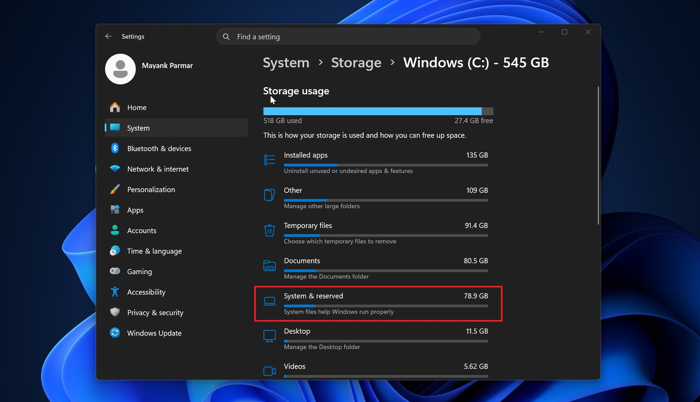
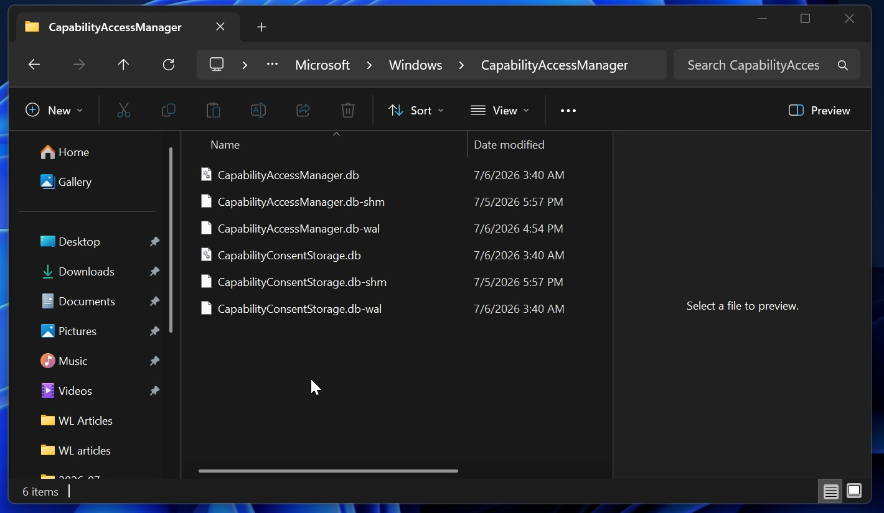
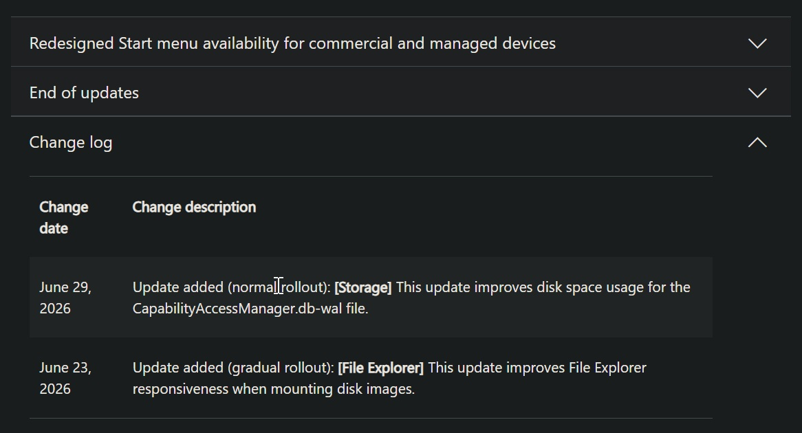
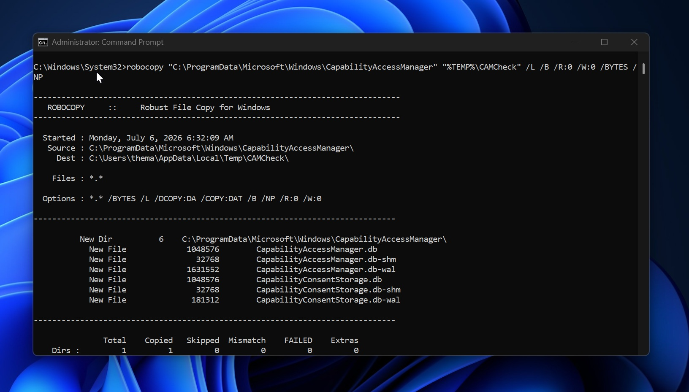
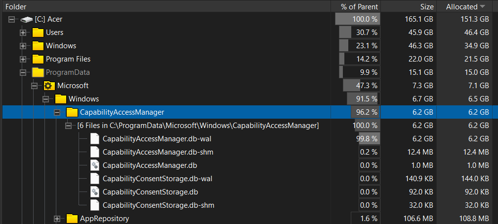
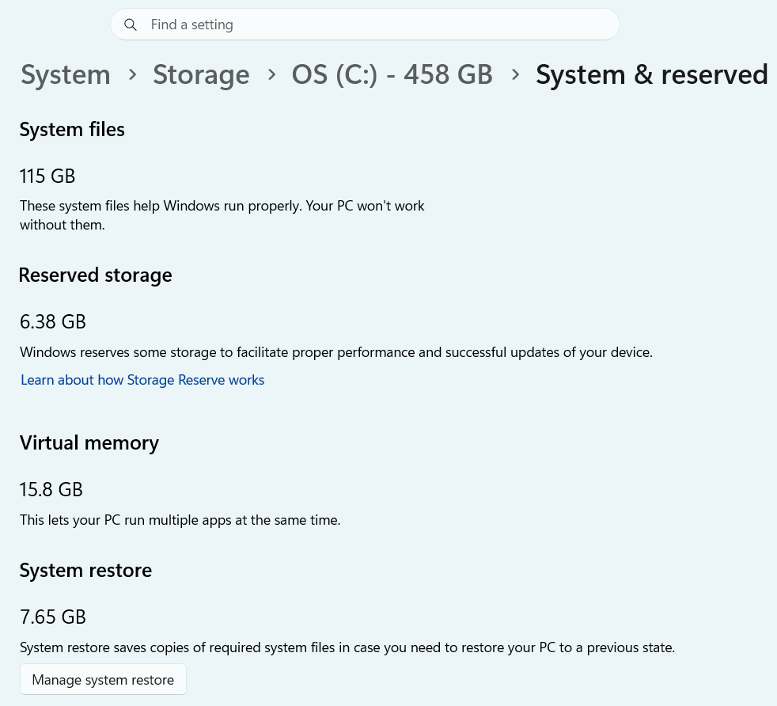

# Windows 11 出现吃掉最多 500GB 存储空间的 Bug：起因、原因、解决方案

> **来源**：Windows Latest，Mayank Parmar，2026-07-06
> **原文链接**：https://www.windowslatest.com/2026/07/06/microsoft-admits-a-windows-11-bug-is-eating-up-to-500gb-of-storage-verify-if-you-are-affected/
> **正文图片归属**：© Windows Latest，所有截图均下载自原文以供技术说明引用。

微软在 6 月 29 日发布的 Windows 11 **KB5095093** 可选更新中承认，系统中存在一个与 Capability Access Manager 相关的 Bug，会让一个数据库日志文件持续膨胀，最严重时占据 **500GB** 存储空间，直至把 C 盘填满。截至发稿，微软**未将该问题列入 Windows 已知问题**（Windows Known Issues Dashboard），也未在发布说明中解释为何部分系统会让该文件膨胀至数十至数百 GB。


*图 1：作者 Mayank Parmar 本人在自己 Windows 11 系统上看到的 Settings → Storage 页面。System & reserved 已占用 78.9GB，但页面并不告诉用户是哪个具体文件。*

---

## 一、起因：2026 年初的一次 Windows 11 更新埋下隐患

Windows Latest 援引信源指出，**2026 年 2 月或 3 月**发布的一次 Windows 11 更新在系统中引入了对 Capability Access Manager 数据库写入路径的回归（regression）。这一回归并未在当时的发布说明中作为已知问题列出，社区与 Windows Insider 也花了数月时间才把分散在 Feedback Hub、Reddit r/techsupport 等渠道的报告归并为同一个根因。

被波及的具体文件是 **CapabilityAccessManager.db-wal**，它位于受系统保护的路径：

```
C:\ProgramData\Microsoft\Windows\CapabilityAccessManager\
```


*图 2：File Explorer 打开该文件夹后的样子。默认情况下，PowerShell 或资源管理器直接访问会提示 "Access denied"。*

这条路径之所以"潜伏成功"，是因为两层隐藏叠加：

1. **存储设置中的"系统与保留"页面只显示总量**，不指向具体文件。
2. **该目录默认受保护**，用户即便怀疑到这层也无法直接确认。

Parmar 在原文中写道："you wouldn't realize you are affected until you manually check the file storage"——直到微软更新发布说明，他才意识到自己的 89GB 系统文件占用其实源于这里。

更关键的是，微软在这几个月的例行更新里都没有正面回应。直到 **6 月 29 日**，KB5095093 的发布说明才被悄悄追加了一行：

> **[Storage] This update improves disk space usage for the CapabilityAccessManager.db-wal file.**


*图 3：微软在 6 月 29 日的 KB5095093 change log 中悄悄加了"Storage"修复条目。同一条修复将在 7 月 Patch Tuesday 自动推送，但官方并未在 Windows Known Issues Dashboard 上把它标为已知问题。*

---

## 二、原因：WAL 文件没被合并回主数据库

要理解这个 Bug，需要先了解 Capability Access Manager 的工作机制。它是 Windows 11 用来跟踪应用对**麦克风、位置、摄像头、屏幕录制**等隐私相关能力访问的子系统，本质上是一个 SQLite 数据库加上一个**预写日志（WAL, Write-Ahead Log）**：

- **主数据库 `CapabilityAccessManager.db`**：记录长期状态；
- **预写日志 `CapabilityAccessManager.db-wal`**：保存尚未合并进主库的临时写入，用于提升并发写入与故障恢复能力。

正常情况下，WAL 文件可以临时增长，但系统应定期将其内容 checkpoint / merge 回主 SQLite 数据库，使 WAL 体积保持在 MB 级别。Windows Latest 在对照测试中检查了一台未受影响的 Windows 11：整个 CapabilityAccessManager 目录小于 4MB，`CapabilityAccessManager.db-wal` 约 **1.6MB**。


*图 4：在管理员命令提示符下用 robocopy 列出该目录。可以看到 CapabilityAccessManager.db-wal 约 1.6MB、整个目录不到 4MB——这是"未受影响"的对照状态。*

而 2026 年 2—3 月的那次回归打破了这一合并机制。Windows Latest 援引信源表示：**操作系统持续记录重复的访问请求 / 隐私事件**（例如位置、麦克风等），但 WAL 文件没有正确地被合并 / 压缩回主 SQLite 数据库。其结果是 WAL 单调增长，从数十 GB 起步一路吃到上百 GB。

在 Reddit r/techsupport 的一条线索中，有用户报告 TreeSize 显示该文件达到约 **513GB**，而同一系统上的 pagefile.sys + hiberfil.sys 加起来也只有约 29GB。其他用户报告 70GB、110GB、200GB 不等，部分机器清理后回落到 4GB 或 15GB。


*图 5：在已受影响机器上用 TreeSize 类工具查看该目录。整个目录 6.2GB，**CapabilityAccessManager.db-wal 占 99.8%（6.2GB）**——只是这还是"中度"情况，严重的机器是几百 GB 量级。*

之所以"并非所有用户都中招"，原文给出的依据是"some users are more affected than others depending on the apps they use"。结合 WAL 的工作原理可推断：调用摄像头 / 麦克风 / 位置 API 的频率越高 → 预写日志的写入越频繁 → 一旦合并机制失灵，膨胀就越严重。

---

## 三、解决方案：升级 KB5095093，必要时手动清理

按风险从低到高，分四档：

### 方案 A：安装 Windows 11 KB5095093（首选）

打开 **设置 → Windows Update**，检查可选更新并安装 KB5095093（2026 年 6 月可选更新）。如果不想立刻装可选更新，可以**等到 7 月 Patch Tuesday**，该修复会随安全更新自动推送给所有 Windows 11 用户。

### 方案 B：用 `robocopy` 安全自查（无需修改权限）

不要试图修改 `C:\ProgramData\Microsoft\Windows\CapabilityAccessManager\` 的所有权或权限——这会带来不必要的系统风险。Windows Latest 推荐的方法是在管理员命令提示符下用 **robocopy** 的"只列不复制"模式列出该目录的文件大小：

```
robocopy "C:\ProgramData\Microsoft\Windows\CapabilityAccessManager" "%TEMP%\CAMCheck" /L /B /R:0 /W:0 /BYTES /NP
```

| 参数 | 作用 |
|------|------|
| `/L` | 只列出文件，不实际复制 |
| `/B` | 备份模式读取，能绕过 "Access denied" 看到受保护文件 |
| `/R:0` / `W:0` | 访问被拒时不重试、不等待 |
| `/BYTES` | 以字节为单位显示 |
| `/NP` | 不显示进度（输出更干净） |

输出中若 `CapabilityAccessManager.db-wal` 只有几 MB（参考图 4，约 1.6MB），机器未受影响；若达到数 GB 并仍在持续增长，则确认受影响。

### 方案 C：磁盘已满导致 Windows Update 装不上的应急处理

如果 C 盘已经被 WAL 撑满、Windows Update 无法下载安装包，恢复路径是：

1. 进入 **Windows 恢复环境（WinRE）** 或 **安全模式**。
2. 找到 `C:\ProgramData\Microsoft\Windows\CapabilityAccessManager\CapabilityAccessManager.db-wal`。
3. **重命名**这个超大文件（例如改成 `.old`），让 Windows 在重启后自动重建一个全新的小 WAL。

⚠️ **不要在正常运行的系统中直接删除这个文件**——它可能仍在被 Capability Access Manager 引用。Parmar 在原文中强调：除非你清楚自己在做什么，否则不要随意删除系统文件。

### 方案 D：升级后的二次验证

装完 KB5095093 后，重新跑一遍方案 B 的 `robocopy` 命令，观察 `CapabilityAccessManager.db-wal` 是否回到几 MB 级别；同时在 **设置 → 存储 → 系统与保留 → 系统文件** 中查看"系统文件"占用是否回到正常范围。


*图 6：设置 → 存储 → 系统与保留 → 系统文件 是发现此 Bug 的第一线索。如果这里显示的是个位数 GB 一般没事；如果是 50GB / 100GB+，很可能就是 CapabilityAccessManager.db-wal 在堆积。*

---

## 四、关键时间线

- **2026 年 2—3 月**：引发 Bug 的 Windows 11 更新发布。
- **2026 年上半年**：用户在 Feedback Hub、Reddit r/techsupport 等渠道陆续报告 CapabilityAccessManager.db-wal 异常膨胀，幅度从 70GB 到 513GB 不等。
- **2026 年 6 月 29 日**：微软在 KB5095093 发布说明中追加一行 Storage 修复说明；同一修复将在 7 月 Patch Tuesday 自动推送。
- **2026 年 7 月**：原作者 Mayank Parmar 发布完整说明文章，呼吁微软在 Windows Known Issues Dashboard 上正式登记此问题。

---

## 五、小结

这是一个典型的"小功能模块引入回归、用户数据被静默吞噬"的 Bug。**触发面有限但破坏面极大**：只要 WAL 不断写入且合并失败，几百 GB 的空间可能在几天内被吃光。**检测不需要修改权限**，用 `robocopy /L /B` 就能在不破坏系统的前提下看到真实文件大小；阈值记住：**正常 ~1.6MB、异常数 GB**。**修复也不复杂**，对多数用户来说，安装 6 月可选更新或等 7 月 Patch Tuesday 即可；如果已经满盘，进 WinRE 重命名 WAL 文件也能恢复。

Parmar 直言：截至发稿，微软仍未在 Windows Known Issues Dashboard 上正式承认此问题——意味着大量用户在 7 月 Patch Tuesday 到来之前，都不会意识到自己的 C 盘正在被 Capability Access Manager 静默吞掉。把这条 `robocopy` 命令和"~1.6MB / 数 GB"两个阈值记下来，可能是 Windows 11 用户在未来几个月内最该做的事。

---

## 参考来源

- [Microsoft admits a Windows 11 bug is eating up to 500GB of storage, verify if you are affected — Windows Latest](https://www.windowslatest.com/2026/07/06/microsoft-admits-a-windows-11-bug-is-eating-up-to-500gb-of-storage-verify-if-you-are-affected/) — 全文事实、数据、引语的唯一来源。
- 截图所有权与版权 © Windows Latest / Mayank Parmar，仅供本次技术说明引用。
